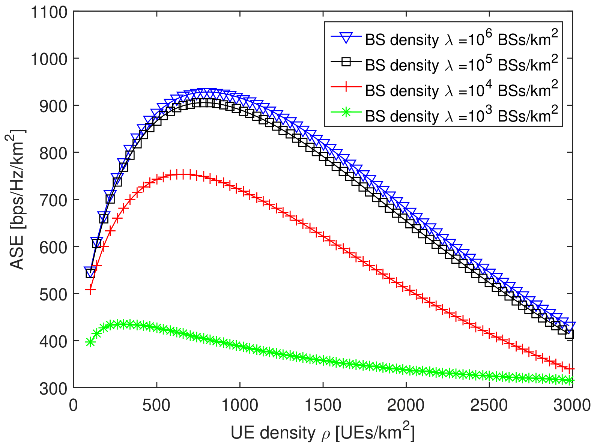

## Ultra-Dense Network Notes  
------

### [Jeffrey G. Andrews](https://ieeexplore.ieee.org/author/37271209100)  
The University of Texas at Austin

2019 Keyword: **1-Bit, Asymptotic Analysis**

>[[1]](https://ieeexplore.ieee.org/document/8663458) Balevi, Eren, and **Jeffrey G. Andrews**. "One-bit OFDM receivers via deep learning." IEEE Transactions on Communications (2019). **Cited by 12**

>[[2]](https://ieeexplore.ieee.org/document/8375976) AlAmmouri, Ahmad, **Jeffrey G. Andrews**, and François Baccelli. "A unified asymptotic analysis of area spectral efficiency in ultradense cellular networks." IEEE Transactions on Information Theory 65.2 (2018): 1236-1248. **Cited by 10**

2018 Keyword: **Stretched Exponential Path Loss, Random Blockages**

>[[1]](https://ieeexplore.ieee.org/document/8122033) AlAmmouri, Ahmad, Jeffrey G. Andrews, and François Baccelli. "SINR and throughput of dense cellular networks with stretched exponential path loss." IEEE Transactions on Wireless Communications 17.2 (2017): 1147-1160. **Cited by 36**

>[[2]](https://ieeexplore.ieee.org/document/8114332) Gupta, Abhishek K., Jeffrey G. Andrews, and Robert W. Heath. "Macrodiversity in cellular networks with random blockages." IEEE Transactions on Wireless Communications 17.2 (2017): 996-1010. **Cited by 28**

----

### [Robert Heath](https://scholar.google.com/citations?hl=zh-CN&user=17Ko8Q0AAAAJ&view_op=list_works&sortby=pubdate)  
The University of Texas at Austin

2019 Keyword: **mmWave Beam Selection, 1-Bit ADC Channel Estimation**

>[[1]](https://ieeexplore.ieee.org/abstract/document/8692745) Myers, Nitin Jonathan, and **Robert W. Heath**. "Message passing-based joint CFO and channel estimation in mmWave systems with one-bit ADCs." IEEE Transactions on Wireless Communications (2019).

>[[2]](https://ieeexplore.ieee.org/abstract/document/8642397) Klautau, Aldebaro, Nuria González-Prelcic, and **Robert W. Heath**. "LIDAR Data for Deep Learning-Based mmWave Beam-Selection." IEEE Wireless Communications Letters (2019).

---

### Lopez-Perez, David, and Ming Ding. "A Brief History on the Theoretical Analysis of Dense Small Cell Wireless Networks." arXiv preprint arXiv:1812.02269 (2018).[[1]](https://arxiv.org/pdf/1812.02269.pdf)

The author considers  the impact of the following factors on ultradense networks (UDNs)  
1. closed-access operations and line-ofsight conditions   
2. the near-field effect  
3. the antenna height difference between small cell BSs and user equipments (UEs)  
4. the surplus of idle-mode-enabled small cell BSs with respect to UEs.  
It is concluded that  the existence of an optimum BS density to maximise the area spectral efficiency (ASE) for a given finite UE density.  

 

Figure 1. (a) Coverage Probability. (b) Area Spectral Efficiency.

Figure 2. There is an optimal UE density that maximises ASE
[bps/Hz/km2] the ASE for a given BS density.

 

Figure 3. The ASE [bps/Hz/km2] performance varies with both the BS density and the UE density.

---
### AlAmmouri, Ahmad, Jeffrey G. Andrews, and François Baccelli. "A unified asymptotic analysis of area spectral efficiency in ultradense cellular networks." IEEE Transactions on Information Theory 65.2 (2018): 1236-1248. [[2]](https://ieeexplore.ieee.org/document/8375976)  

The author studies the asymptotic properties of average area spectral efficiency (ASE) of a downlink cellular network in the limit of very dense base station (BS) and user densities. When there is no constraint on the minimum operational signal-to-interference-plus-noise ratio (SINR) and instantaneous full channel state information (CSI) is available at the transmitter, the average ASE is proven to saturate to a constant.

A. Propagation Model

---
### Reference  
[1] Lopez-Perez, David, and Ming Ding. "A Brief History on the Theoretical Analysis of Dense Small Cell Wireless Networks." arXiv preprint arXiv:1812.02269 (2018).  
[2] AlAmmouri, Ahmad, Jeffrey G. Andrews, and François Baccelli. "A unified asymptotic analysis of area spectral efficiency in ultradense cellular networks." IEEE Transactions on Information Theory 65.2 (2018): 1236-1248.
