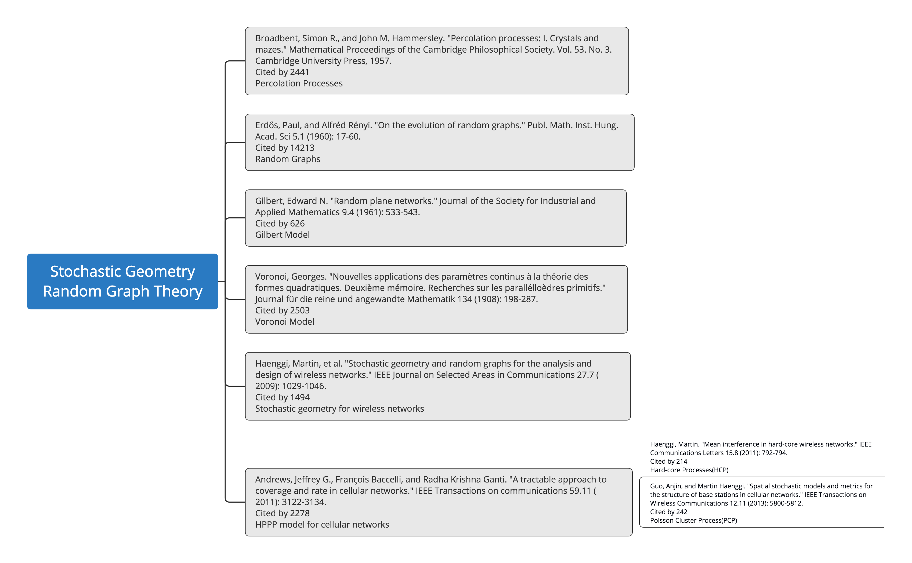

## Ultra-Dense Network Notes  
------

### [Jeffrey G. Andrews](https://ieeexplore.ieee.org/author/37271209100)  
The University of Texas at Austin

2019 Keyword: **1-Bit, Asymptotic Analysis**

>[[1]](https://ieeexplore.ieee.org/document/8663458) Balevi, Eren, and **Jeffrey G. Andrews**. "One-bit OFDM receivers via deep learning." IEEE Transactions on Communications (2019). **Cited by 12**

>[[2]](https://ieeexplore.ieee.org/document/8375976) AlAmmouri, Ahmad, **Jeffrey G. Andrews**, and François Baccelli. "A unified asymptotic analysis of area spectral efficiency in ultradense cellular networks." IEEE Transactions on Information Theory 65.2 (2018): 1236-1248. **Cited by 10**

2018 Keyword: **Stretched Exponential Path Loss, Random Blockages**

>[[1]](https://ieeexplore.ieee.org/document/8122033) AlAmmouri, Ahmad, Jeffrey G. Andrews, and François Baccelli. "SINR and throughput of dense cellular networks with stretched exponential path loss." IEEE Transactions on Wireless Communications 17.2 (2017): 1147-1160. **Cited by 36**

>[[2]](https://ieeexplore.ieee.org/document/8114332) Gupta, Abhishek K., Jeffrey G. Andrews, and Robert W. Heath. "Macrodiversity in cellular networks with random blockages." IEEE Transactions on Wireless Communications 17.2 (2017): 996-1010. **Cited by 28**

----

### [Robert Heath](https://scholar.google.com/citations?hl=zh-CN&user=17Ko8Q0AAAAJ&view_op=list_works&sortby=pubdate)  
The University of Texas at Austin

2019 Keyword: **mmWave Beam Selection, 1-Bit ADC Channel Estimation**

>[[1]](https://ieeexplore.ieee.org/abstract/document/8692745) Myers, Nitin Jonathan, and **Robert W. Heath**. "Message passing-based joint CFO and channel estimation in mmWave systems with one-bit ADCs." IEEE Transactions on Wireless Communications (2019).

>[[2]](https://ieeexplore.ieee.org/abstract/document/8642397) Klautau, Aldebaro, Nuria González-Prelcic, and **Robert W. Heath**. "LIDAR Data for Deep Learning-Based mmWave Beam-Selection." IEEE Wireless Communications Letters (2019).

---

### Lopez-Perez, David, and Ming Ding. "A Brief History on the Theoretical Analysis of Dense Small Cell Wireless Networks." arXiv preprint arXiv:1812.02269 (2018).[[1]](https://arxiv.org/pdf/1812.02269.pdf)

The author considers  the impact of the following factors on ultradense networks (UDNs)  
1. closed-access operations and line-ofsight conditions   
2. the near-field effect  
3. the antenna height difference between small cell BSs and user equipments (UEs)  
4. the surplus of idle-mode-enabled small cell BSs with respect to UEs.  
It is concluded that  the existence of an optimum BS density to maximise the area spectral efficiency (ASE) for a given finite UE density.  

 

Figure 1. (a) Coverage Probability. (b) Area Spectral Efficiency.

Figure 2. There is an optimal UE density that maximises ASE
[bps/Hz/km2] the ASE for a given BS density.

 

Figure 3. The ASE [bps/Hz/km2] performance varies with both the BS density and the UE density.

---
### AlAmmouri, Ahmad, Jeffrey G. Andrews, and François Baccelli. "A unified asymptotic analysis of area spectral efficiency in ultradense cellular networks." IEEE Transactions on Information Theory 65.2 (2018): 1236-1248. [[2]](https://ieeexplore.ieee.org/document/8375976)  

The author studies the asymptotic properties of average area spectral efficiency (ASE) of a downlink cellular network in the limit of very dense base station (BS) and user densities. When there is no constraint on the minimum operational signal-to-interference-plus-noise ratio (SINR) and instantaneous full channel state information (CSI) is available at the transmitter, the average ASE is proven to saturate to a constant.

**A. Related Work**  
The study of dense wireless network capacity has a rich history, in particular for the case of ad hoc multi-hop networks. The seminal result of Gupta and Kumar [3]:(Cited by 10082)showed that the transport capacity of an infrastructure-less network increases with the number of nodes n roughly as , assuming a given node wishes to transmit with a randomly selected other node.

**B. Contributions**  
The main contribution is a general answer to the question of how average ASE scales in a cellular network with very large density.

**Performance Analysis**  
>Lemma 1:  
When λ→∞ , the SINR as defined in [3] tends to zero a.s.

>Lemma 2:  
The asymptotic average ASE is lower bounded by  

>Theorem 1:  
Let , Where Ψ is a PPP with intensity λ0 . If the second negative moment of I is finite for all λ0≥λc , where λc∈ℝ+ is a constant, then  
  
Theorem 1 shows that the average ASE converges to a finite constant, which practically means that we cannot keep harvesting performance gains by densifying the network;

>Theorem 2:  
If the path loss function satisfies the condition in Theorem 1 and θ0≥ϵ>0 , then,  

>Theorem 3:  
If the path loss function satisfies the conditions in Theorem 1, then for all θ0∈ℝ+ ,  
  
where R(λ) is the average potential throughput.

**Open Issues**  
1. Characterizing at what density the average ASE saturation or collapse manifest.  
2. Considering the effects of advanced interference suppression techniques such as joint (over multiple BSs) transmission or decoding, or successive interference cancellation.

---

### Stochastic Geometry

Figure 4.Stochastic geometry development history

---
### Reference  
[1] Lopez-Perez, David, and Ming Ding. "A Brief History on the Theoretical Analysis of Dense Small Cell Wireless Networks." arXiv preprint arXiv:1812.02269 (2018).  
[2] AlAmmouri, Ahmad, Jeffrey G. Andrews, and François Baccelli. "A unified asymptotic analysis of area spectral efficiency in ultradense cellular networks." IEEE Transactions on Information Theory 65.2 (2018): 1236-1248.  
[3] P. Gupta, P. R. Kumar, "The capacity of wireless networks", IEEE Trans. Inf. Theory, vol. 46, no. 2, pp. 388-404, Mar. 2000.
