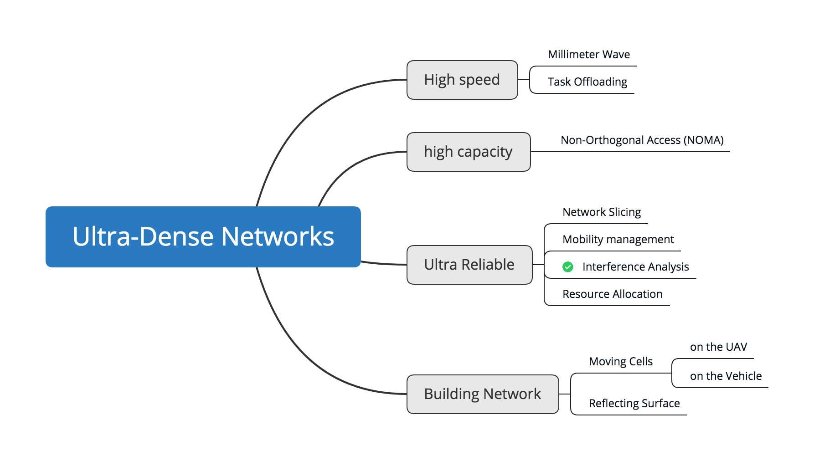
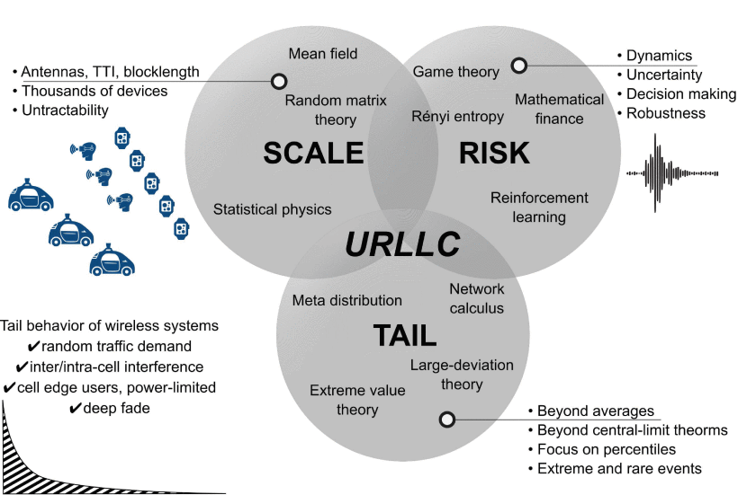

Ultra-Dense Networks Latest research: A Surveys
---
### I have a questions.
What do I need to do this semester?  
for example: write a Conference, write a Survey, find a topic and do related experiments。

Figure 1. Taxonomy of spectrum prediction algorithms<a href="https://ieeexplore.ieee.org/document/8031332">[1]</a>

### Cited by 145. Bennis, Mehdi, Mérouane Debbah, and H. Vincent Poor. "Ultrareliable and low-latency wireless communication: Tail, risk, and scale." Proceedings of the IEEE 106.10 (2018): 1834-1853.[[1]](https://ieeexplore.ieee.org/abstract/document/8472907)

#### The main points:   
URLLC can be broken down into three major building blocks, namely: 1) risk; 2) tail; and 3) scale.
>**Risk:** It is naturally encountered when dealing with decision making under uncertainty, when channels are time-varying and in the presence of network dynamics. Here, decentralized or semi-centralized algorithms providing performance guarantees and robustness are at stake, and notably ***game theory and reinforcement learning***.

>**Tail:** The notion of tail behavior in wireless systems is inherently related to the tail of random traffic demand, tail of latency distribution, intra/inter-cell interference, and users that are at the cell edge, power-limited or in deep fade. In this regard, ***extreme value theory, mathematical finance and network calculus*** are important methodologies.

>**Scale:** This is motivated by the sheer amount of devices, antennas, sensors and other nodes which pose serious challenges in terms of resource allocation and network design. For this purpose, ***mean field (and mean field game) theory, statistical physics and random matrix theory*** are important tools.

Figure 1. Anatomy of the URLLC building blocks, composed of tail, scale and risk alongside their unique characteristics. In addition, mathematical tools tailored to the requirements of every block are highlighted therein. <a href="https://ieeexplore.ieee.org/abstract/document/8472907">[1]</a>

#### various enablers for low-latency communication
>1. Short transmission time interval (TTI), short frame structure, and hybrid automatic repeat request (HARQ);
>2. eMBB/URLLC multiplexing;
>3. Edge caching, computing, and slicing;
>4. On-device machine learning and artificial intelligence (AI) at the network edge;
>5. Grant-free versus grant-based access;
>6. Nonorthogonal multiple access (NOMA);
>7. Low/medium-earth orbit (LEO/MEO) satellites and unmanned aerial vehicles (UAVs);
>8. Joint flexible resource allocation for uplink/downlink;

#### The main factors affecting reliability stem from:
>1. collisions with other users due to uncoordinated channel access;
>2. coexistence with other systems in the same frequency bands;
>3. interference from users in adjacent channels;
>4. Doppler shifts from moving devices;
>5. difficulty of synchronization, outdated channel state information, time-varying channel effects or delayed packet reception.

---
## High Citation：
### Survey
[//]: # (survey)
[[1]](https://ieeexplore.ieee.org/abstract/document/8454520)<!--所有技术共同合作造福：未来的移动网络概览--> Yadav, Animesh, and Octavia A. Dobre. "All technologies work together for good: A glance at future mobile networks." IEEE Wireless Communications 25.4 (2018): 10-16.

[[2]](https://ieeexplore.ieee.org/abstract/document/8436053)<!--5G超密集网络中的流量匹配--> Zhong, Yi, et al. "Traffic matching in 5G ultra-dense networks." IEEE Communications Magazine 56.8 (2018): 100-105.

[[3]](https://ieeexplore.ieee.org/abstract/document/8387202)<!--异构超密集网络的物理层安全性，缓存和无线能量收集的新外观--> Wang, Lifeng, et al. "A new look at physical layer security, caching, and wireless energy harvesting for heterogeneous ultra-dense networks." IEEE Communications Magazine 56.6 (2018): 49-55.

[[4]](https://ieeexplore.ieee.org/abstract/document/8284057)<!--下一代无线通信的压缩传感技术--> Gao, Zhen, et al. "Compressive sensing techniques for next-generation wireless communications." IEEE Wireless Communications 25.3 (2018): 144-153.
<!---->

[[5]](https://ieeexplore.ieee.org/abstract/document/8387218)<!--Terahertz Technologies将在5G之后的无线系统中提供光网络体验质量--> Boulogeorgos, Alexandros-Apostolos A., et al. "Terahertz technologies to deliver optical network quality of experience in wireless systems beyond 5G." IEEE Communications Magazine 56.6 (2018): 144-151.

[[6]](https://ieeexplore.ieee.org/abstract/document/8387197)<!--超密集5G网络的以用户为中心的C-RAN架构：挑战和方法论--> Pan, Cunhua, et al. "User-centric C-RAN architecture for ultra-dense 5G networks: Challenges and methodologies." IEEE Communications Magazine 56.6 (2018): 14-20.

[[7]](https://ieeexplore.ieee.org/abstract/document/8387205)<!--在非授权频谱中保持异构超密集分布网络的可靠性--> Cui, Qimei, et al. "Preserving reliability of heterogeneous ultra-dense distributed networks in unlicensed spectrum." IEEE Communications Magazine 56.6 (2018): 72-78.
<!---->

[[8]](https://ieeexplore.ieee.org/abstract/document/8454520)<!--所有技术共同合作造福：未来的移动网络概览--> Yadav, Animesh, and Octavia A. Dobre. "All technologies work together for good: A glance at future mobile networks." IEEE Wireless Communications 25.4 (2018): 10-16.

[[9]](https://ieeexplore.ieee.org/abstract/document/8387203)<!--超密集HetNet满足大数据：绿色框架，技术和方法--> Li, Yuzhou, et al. "Ultra-dense hetnets meet big data: Green frameworks, techniques, and approaches." IEEE Communications Magazine 56.6 (2018): 56-63.

[[10]](https://ieeexplore.ieee.org/abstract/document/8370884)<!--超密集小蜂窝网络的基本特征--> Ding, Ming, et al. "On the fundamental characteristics of ultra-dense small cell networks." IEEE Network 32.3 (2018): 92-100.

[[11]](https://ieeexplore.ieee.org/abstract/document/8722593)<!--超越5G的超密集网络的未来：利用异构移动细胞--> Andreev, Sergey, et al. "Future of ultra-dense networks beyond 5G: harnessing heterogeneous moving cells." IEEE Communications Magazine (2019).

[[12]](https://ieeexplore.ieee.org/abstract/document/8387201)<!--超密集网络的广义稀疏和低秩优化-->Shi, Yuanming, et al. "Generalized sparse and low-rank optimization for ultra-dense networks." IEEE Communications Magazine 56.6 (2018): 42-48.

[[13]](https://ieeexplore.ieee.org/abstract/document/8316764)<!--5G新无线电中的初始访问，移动性和以用户为中心的多波束操作--> Liu, Jin, et al. "Initial access, mobility, and user-centric multi-beam operation in 5G new radio." IEEE Communications Magazine 56.3 (2018): 35-41.

### Reflecting Surface
[//]: # (反射)
[[1]](https://ieeexplore.ieee.org/abstract/document/8647620)<!--智能反射表面增强型无线网络：主动和被动波束成形联合设计--> Wu, Qingqing, and Rui Zhang. "Intelligent reflecting surface enhanced wireless network: Joint active and passive beamforming design." 2018 IEEE Global Communications Conference (GLOBECOM). IEEE, 2018.

[[2]](https://ieeexplore.ieee.org/abstract/document/8253544)<!--环境后向散射辅助无线通信--> Lu, Xiao, et al. "Ambient backscatter assisted wireless powered communications." IEEE Wireless Communications 25.2 (2018): 170-177.

[[3]](https://arxiv.org/abs/1905.00152)<!--迈向智能和可重构环境：智能反射表面辅助无线网络--> Qingqing, Wu, and Zhang Rui. "Towards smart and reconfigurable environment: Intelligent reflecting surface aided wireless network." arXiv preprint arXiv:1905.00152 (2019).

### Resource Management
[//]: # (干扰管理，资源分配，移动性管理)
<!---->
<!---->
[[1]](https://ieeexplore.ieee.org/abstract/document/8272494)<!--超密集网络中的干扰管理：以用户为中心的联盟形成博弈方法--> Cao, Jiaqi, et al. "Interference management in ultradense networks: A user-centric coalition formation game approach." IEEE Transactions on Vehicular Technology 67.6 (2018): 5188-5202.

[[2]](https://ieeexplore.ieee.org/abstract/document/8304530)<!--超密集网络中的移动性管理：切换跳过技术--> Demarchou, Eleni, Constantinos Psomas, and Ioannis Krikidis. "Mobility management in ultra-dense networks: Handover skipping techniques." IEEE Access 6 (2018): 11921-11930.

[[3]](https://ieeexplore.ieee.org/abstract/document/8447187)<!--超密集网络的资源分配：一项调查，一些研究问题和挑战--> Teng, Yinglei, et al. "Resource allocation for ultra-dense networks: A survey, some research issues and challenges." IEEE Communications Surveys & Tutorials (2018).

[[4]](https://ieeexplore.ieee.org/abstract/document/8467353)<!--雾网络中超可靠和增强的移动宽带IoT应用的资源分配--> Abedin, Sarder Fakhrul, et al. "Resource allocation for ultra-reliable and enhanced mobile broadband IoT applications in fog network." IEEE Transactions on Communications 67.1 (2018): 489-502.

[[5]](https://ieeexplore.ieee.org/abstract/document/8247283)<!--CSI不完善的以用户为中心的超密集TDD C-RAN的联合导频分配和鲁棒传输设计--> Pan, Cunhua, et al. "Joint pilot allocation and robust transmission design for ultra-dense user-centric TDD C-RAN with imperfect CSI." IEEE Transactions on Wireless Communications 17.3 (2018): 2038-2053.

[[6]](https://ieeexplore.ieee.org/abstract/document/8327815)<!--具有干扰的超密集无线网络的有效容量分析--> Pan, Cunhua, et al. "Joint pilot allocation and robust transmission design for ultra-dense user-centric TDD C-RAN with imperfect CSI." IEEE Transactions on Wireless Communications 17.3 (2018): 2038-2053.

[[7]](https://ieeexplore.ieee.org/abstract/document/8274926)<!--具有NLoS和LoS传输的超密集异构网络的节能部署--> Yang, Bin, et al. "On the energy-efficient deployment for ultra-dense heterogeneous networks with NLoS and LoS transmissions." IEEE Transactions on Green Communications and Networking 2.2 (2018): 369-384.

[[8]](https://ieeexplore.ieee.org/abstract/document/8249837)<!--回程受限的超密集异构网络的灵活覆盖范围：吞吐量分析和η-最佳偏置--> Zhang, Hongtao, et al. "Flexible Coverage for Backhaul-Limited Ultradense Heterogeneous Networks: Throughput Analysis and $\eta $-Optimal Biasing." IEEE Transactions on Vehicular Technology 67.5 (2018): 4161-4172.

### Task Offloading
[//]: # (边缘计算，任务分载)  
[[1]](https://ieeexplore.ieee.org/abstract/document/8314696)<!--通信模型，分流模型，目标函数，任务放置算法，收敛分析--> Chen, M and Hao, Y. "Task offloading for mobile edge computing in software defined ultra-dense network." IEEE Journal on Selected Areas in … ieeexplore.ieee.org, 2018  

[[2]](https://ieeexplore.ieee.org/abstract/document/8485977)<!--密集网络中移动边缘计算的联合服务缓存和任务分载--> Xu, Jie, Lixing Chen, and Pan Zhou. "Joint service caching and task offloading for mobile edge computing in dense networks." IEEE INFOCOM 2018-IEEE Conference on Computer Communications. IEEE, 2018.

[[3]](https://ieeexplore.ieee.org/abstract/document/8361406)<!--超密集物联网网络的移动边缘计算分流--> Guo, Hongzhi, et al. "Mobile-edge computation offloading for ultradense IoT networks." IEEE Internet of Things Journal 5.6 (2018): 4977-4988.

[[4]](https://ieeexplore.ieee.org/abstract/document/8533343)<!--多服务器移动边缘计算网络的联合任务分载和资源分配--> Tran, Tuyen X., and Dario Pompili. "Joint task offloading and resource allocation for multi-server mobile-edge computing networks." IEEE Transactions on Vehicular Technology 68.1 (2018): 856-868.

[[5]](https://ieeexplore.ieee.org/abstract/document/8403947)<!--Edge-CoCaCo：实现边缘云上计算，缓存和通信的联合优化--> Chen, Min, et al. "Edge-CoCaCo: Toward joint optimization of computation, caching, and communication on edge cloud." IEEE Wireless Communications 25.3 (2018): 21-27.

[[6]](https://ieeexplore.ieee.org/abstract/document/8553648)<!--边缘网络中流量控制的无标签学习--> Chen, Min, et al. "Label-less learning for traffic control in an edge network." IEEE Network 32.6 (2018): 8-14.
<!---->

[[7]](https://ieeexplore.ieee.org/abstract/document/8436044)<!--车辆边缘多路访问网络中的协作任务分载--> Qiao, Guanhua, et al. "Collaborative task offloading in vehicular edge multi-access networks." IEEE Communications Magazine 56.8 (2018): 48-54.

[[8]](https://ieeexplore.ieee.org/abstract/document/8690980)<!--通过深度强化学习优化移动边缘计算中的性能--> Chen, Xianfu, et al. "Performance optimization in mobile-edge computing via deep reinforcement learning." 2018 IEEE 88th Vehicular Technology Conference (VTC-Fall). IEEE, 2018.

[[9]](https://ieeexplore.ieee.org/abstract/document/8463562)<!--在边缘跟随我：移动边缘计算的移动感知动态服务放置--> Ouyang, Tao, Zhi Zhou, and Xu Chen. "Follow me at the edge: Mobility-aware dynamic service placement for mobile edge computing." IEEE Journal on Selected Areas in Communications 36.10 (2018): 2333-2345.
<!---->

[[10]](https://ieeexplore.ieee.org/abstract/document/8436044)<!--车辆边缘多路访问网络中的协作任务分载--> Qiao, Guanhua, et al. "Collaborative task offloading in vehicular edge multi-access networks." IEEE Communications Magazine 56.8 (2018): 48-54.

[[11]](https://ieeexplore.ieee.org/abstract/document/8334688)<!--使用设备到设备通信的5G超密集网络的负载平衡--> Zhang, Hongliang, Lingyang Song, and Ying Jun Zhang. "Load balancing for 5G ultra-dense networks using device-to-device communications." IEEE Transactions on Wireless Communications 17.6 (2018): 4039-4050.

[[12]](https://ieeexplore.ieee.org/abstract/document/8436039)<!--超密集网络中用于多路访问移动边缘计算的计算分流--> Guo, Hongzhi, Jiajia Liu, and Jie Zhang. "Computation offloading for multi-access mobile edge computing in ultra-dense networks." IEEE Communications Magazine 56.8 (2018): 14-19.

### Non-Orthogonal Access
[//]: # (非正交通信)
[[1]](https://ieeexplore.ieee.org/abstract/document/8387207)<!--启用统一NOMA的异构超密集网络中的用户关联和资源分配--> Qin, Zhijin, et al. "User association and resource allocation in unified NOMA enabled heterogeneous ultra dense networks." IEEE Communications Magazine 56.6 (2018): 86-92.
<!---->

[[2]](https://ieeexplore.ieee.org/abstract/document/8352627)<!--可见光通信的光学非正交多路访问--> Marshoud, Hanaa, et al. "Optical non-orthogonal multiple access for visible light communication." IEEE Wireless Communications 25.2 (2018): 82-88.
<!---->

[[3]](https://ieeexplore.ieee.org/abstract/document/8352616)<!--非正交多路访问：统一视角--> Wang, Qi, et al. "Non-orthogonal multiple access: A unified perspective." IEEE Wireless Communications 25.2 (2018): 10-16.

[[4]](https://ieeexplore.ieee.org/abstract/document/8375949)<!--具有非均匀小蜂窝部署的异构网络中的下行链路NOMA--> Wang, Qi, et al. "Non-orthogonal multiple access: A unified perspective." IEEE Wireless Communications 25.2 (2018): 10-16.

### Network Slicing
[//]: # (网络切片)
[[1]](https://ieeexplore.ieee.org/abstract/document/8320765)<!--网络切片调查--> Afolabi, I, Taleb, T, Samdanis, K and .... "Network slicing and softwarization: A survey on principles, enabling technologies, and solutions." … Surveys & Tutorials ieeexplore.ieee.org, 2018
<!---->

[[2]](https://ieeexplore.ieee.org/abstract/document/8334921)<!--5G网络中网络切片的调查与分析--> Kaloxylos, Alexandros. "A survey and an analysis of network slicing in 5G networks." IEEE Communications Standards Magazine 2.1 (2018): 60-65.

### Air-Ground Integrated
[//]: # (车辆，无人机)
[[1]](https://ieeexplore.ieee.org/abstract/document/8368236) Liu, J, Shi, Y, Fadlullah, ZM and Kato, N. "Space-air-ground integrated network: A survey." … Communications Surveys & … ieeexplore.ieee.org, 2018

[[2]](https://ieeexplore.ieee.org/abstract/document/8387199)<!--无人机支持的超密集网络中的功率控制：通信，缓存和能量传输--> Wang, Haichao, et al. "Power control in UAV-supported ultra dense networks: Communications, caching, and energy transfer." IEEE Communications Magazine 56.6 (2018): 28-34.

[[3]](https://ieeexplore.ieee.org/abstract/document/8436041)<!--空地集成移动边缘网络：架构，挑战和机遇--> Cheng, Nan, et al. "Air-ground integrated mobile edge networks: Architecture, challenges, and opportunities." IEEE Communications Magazine 56.8 (2018): 26-32.

[[4]](https://ieeexplore.ieee.org/abstract/document/8255764)<!--基于FSO的5G +无线网络垂直回传/前传框架--> Alzenad, Mohamed, et al. "FSO-based vertical backhaul/fronthaul framework for 5G+ wireless networks." IEEE Communications Magazine 56.1 (2018): 218-224.

[[5]](https://ieeexplore.ieee.org/abstract/document/8675384)<!--无人机蜂窝通信调查：实践方面，标准化进展，监管和安全挑战--> Fotouhi, Azade, et al. "Survey on uav cellular communications: Practical aspects, standardization advancements, regulation, and security challenges." IEEE Communications Surveys & Tutorials (2019).
<!---->

[[5]](https://ieeexplore.ieee.org/abstract/document/8338071)<!--MmWave车对基础设施通信：城市微蜂窝网络分析--> Wang, Yuyang, et al. "MmWave vehicle-to-infrastructure communication: Analysis of urban microcellular networks." IEEE Transactions on Vehicular Technology 67.8 (2018): 7086-7100.

[[6]](https://ieeexplore.ieee.org/abstract/document/8422685)<!--重塑空中蜂窝网络：主要因素和可行性--> Azari, Mohammad Mahdi, Fernando Rosas, and Sofie Pollin. "Reshaping cellular networks for the sky: Major factors and feasibility." 2018 IEEE International Conference on Communications (ICC). IEEE, 2018.
<!---->

[[7]](https://ieeexplore.ieee.org/abstract/document/8692749)<!--无人机的蜂窝连接性：网络建模，性能分析和设计指南--> Azari, M. Mahdi, Fernando Rosas, and Sofie Pollin. "Cellular connectivity for UAVs: Network modeling, performance analysis and design guidelines." IEEE Transactions on Wireless Communications (2019).

### Ultrareliable and Low-Latency
[//]: # (超可靠和低延迟)
[[1]](https://ieeexplore.ieee.org/abstract/document/8367785)<!-- 低延迟调查--> Parvez, I, Rahmati, A, Guvenc, I and .... "A survey on low latency towards 5G: RAN, core network and caching solutions." … Surveys & Tutorials ieeexplore.ieee.org, 2018

[[2]](https://ieeexplore.ieee.org/abstract/document/8472907)<!--超可靠和低延迟的无线通信：尾部，风险和规模--> Bennis, Mehdi, Mérouane Debbah, and H. Vincent Poor. "Ultra reliable and low-latency wireless communication: Tail, risk, and scale." Proceedings of the IEEE 106.10 (2018): 1834-1853.

[[3]](https://ieeexplore.ieee.org/abstract/document/8329619)<!--超可靠的低延迟通信的无线访问：原理和构建块--> Popovski, Petar, et al. "Wireless access for ultra-reliable low-latency communication: Principles and building blocks." Ieee Network 32.2 (2018): 16-23.
<!---->

[[4]](https://ieeexplore.ieee.org/abstract/document/8329625)<!--5G中具有中继功能的超可靠低延迟通信--> Hu, Yulin, M. Cenk Gursoy, and Anke Schmeink. "Relaying-enabled ultra-reliable low-latency communications in 5G." IEEE Network 32.2 (2018): 62-68.

[[5]](https://ieeexplore.ieee.org/abstract/document/8329621)<!--5G中URLLC的数据包复制：体系结构增强和性能分析--> Rao, Jaya, and Sophie Vrzic. "Packet duplication for URLLC in 5G: Architectural enhancements and performance analysis." IEEE Network 32.2 (2018): 32-40.
<!---->

[[6]](https://ieeexplore.ieee.org/abstract/document/8319949)<!--低延迟毫米波通信：流量分散还是网络密集？--> Yang, Guang, Ming Xiao, and H. Vincent Poor. "Low-latency millimeter-wave communications: Traffic dispersion or network densification?." IEEE Transactions on Communications 66.8 (2018): 3526-3539.

[[7]](https://ieeexplore.ieee.org/abstract/document/8329627)<!--通过非授权频谱实现超可靠和低延迟的通信--> Sutton, Gordon J., et al. "Enabling ultra-reliable and low-latency communications through unlicensed spectrum." IEEE Network 32.2 (2018): 70-77.

[[8]](https://ieeexplore.ieee.org/abstract/document/8399832)<!--通过多连接性提高超可靠和低延迟通信的网络可用性--> She, Changyang, et al. "Improving network availability of ultra-reliable and low-latency communications with multi-connectivity." IEEE Transactions on Communications 66.11 (2018): 5482-5496.

### Deep Learning
[//]: # (机器学习)
[[1]](https://ieeexplore.ieee.org/abstract/document/8618345)<!--基于深度学习的毫米波大规模MIMO用于混合预编码--> Huang, Hongji, et al. "Deep-learning-based millimeter-wave massive MIMO for hybrid precoding." IEEE Transactions on Vehicular Technology 68.3 (2019): 3027-3032.
<!---->

[[2]](https://ieeexplore.ieee.org/abstract/document/8422864)<!--考虑QoS的HetNet中功率分配的机器学习方法--> Amiri, Roohollah, et al. "A machine learning approach for power allocation in HetNets considering QoS." 2018 IEEE International Conference on Communications (ICC). IEEE, 2018.

[[3]](https://ieeexplore.ieee.org/abstract/document/8726067)<!--区块链和深度强化学习助力智能5G超越--> Dai, Yueyue, et al. "Blockchain and deep reinforcement learning empowered intelligent 5g beyond." IEEE Network 33.3 (2019): 10-17.

[[4]](https://ieeexplore.ieee.org/abstract/document/8553651)<!--基于深度学习的5G超密集网络无线资源分配技术--> Zhou, Yibo, et al. "A deep-learning-based radio resource assignment technique for 5G ultra dense networks." IEEE Network 32.6 (2018): 28-34.
<!---->

[[5]](https://ieeexplore.ieee.org/abstract/document/8553655)<!--人工智能管理5G无线网络的网络流量--> Fu, Yu, et al. "Artificial intelligence to manage network traffic of 5G wireless networks." IEEE Network 32.6 (2018): 58-64.
