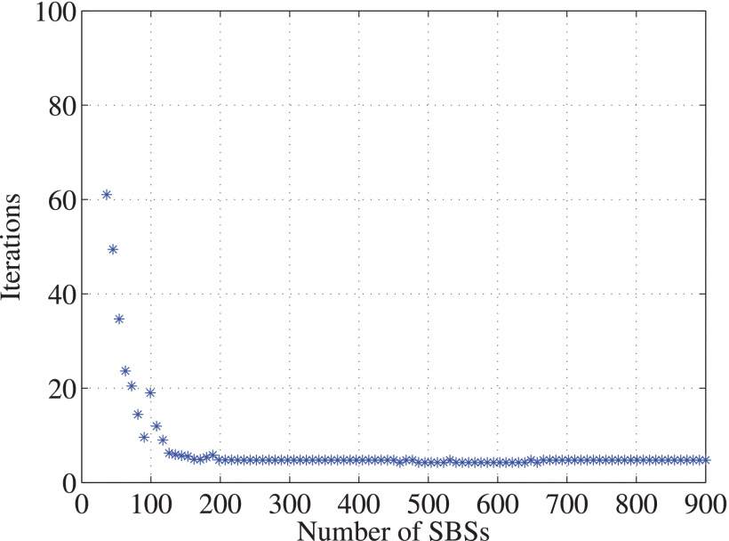
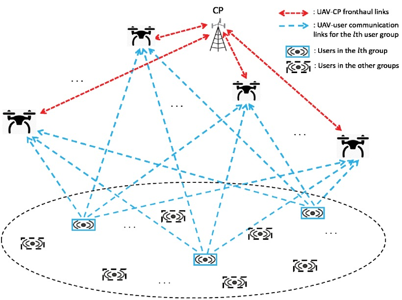
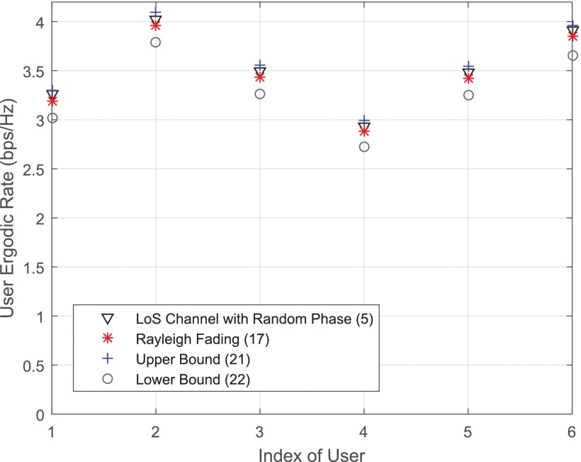

Ultra-Dense Networks Notes
---

### New Idea: Application of Random Matrix in Complex Network Analysis[3-5]

#### Motivation：
1.  Previously, the number of mobile network base stations was small, and the random matrix theory was not well applied. In the past 10 years, the random matrix theory has dealt with multi-dimensional problems(Angle of arrival(AoA)) of MIMO antennas (128 antennas or more), and there are many research results [6]. However, The smart grid it's a large scale and many detection nodes,  there are many research results on grid analysis using random matrix theory [7].
2. (Base Station(BS) density increase) => (Ultra-dense Networks) => (Mean Field Theory) => (BS->∞) => (Random Matrix Theory)
3. (Stochastic graph) => (Stochastic geometry) => (Complex network) => (n->∞) => (Random Matrix Theory)
4. "Random Matrix Theory" with "complex network" can get About 2,550,000 Results in google scholar. however，with "Ultra-dense network" only get About 78,200 results.

#### topic：

Ultra-dense Network how to building modeled by random Matrix?
Heterogeneous Ultra-Dense Networks how to building modeled by random Matrix?

---
### Cited by 107. Samarakoon, Sumudu, et al. "Ultra dense small cell networks: Turning density into energy efficiency." IEEE Journal on Selected Areas in Communications 34.5 (2016): 1267-1280.[[1]](https://ieeexplore.ieee.org/abstract/document/7439746/)

The author of this paper focuses on the study of two issues. Joint power control and user scheduling in Ultra-Dense Networks.  
>Optimal Power control: ***Mean Field Theory***  
>UE Scheduling: ***Lyapunov Framework***

As the number of SBSs becomes large(BS->∞), the author considers that the interference tends to be bounded, since the path loss is modeled according to the inverse square law.

Figure 1. Mean-field interference from the perspective of an SBS<a href="https://ieeexplore.ieee.org/abstract/document/7439746/">[1]</a>

#### As BS->∞,the Interference

Figure 2. Number of iterations to solve the HJB-FPK PDEs for different number of SBSs in the system.<a href="https://ieeexplore.ieee.org/abstract/document/7439746/">[1]</a>

#### The optimal transmit power strategy is given by  

---
### Cited by 24. Liu, Liang, Shuowen Zhang, and Rui Zhang. "CoMP in the sky: UAV placement and movement optimization for multi-user communications." IEEE Transactions on Communications (2019).[[2]](https://ieeexplore.ieee.org/abstract/document/8675440)

The author consider the case where the users may move on the ground, thus the UAVs need to adjust their locations in accordance with the user locations over time to maximize the network throughput.

***The contribution***
1. given the upper and lower bounded of ergodic rate.
2. The dynamic position of UAV under different user location information

Figure 3. Schematic of a UAV-enabled CoMP system.<a href="https://ieeexplore.ieee.org/abstract/document/7439746/">[2]</a>

#### Lemma 1: Ergodic user rate is bounded by

#### In case of  LoS channel with Random phase.

Figure 4. Simulated user ergodic rate under the LoS channel with random phase versus various approximations.<a href="https://ieeexplore.ieee.org/abstract/document/7439746/">[2]</a>

A. Dynamic UAV Placement With Full User Location Information
>the optimal location of UAV m is the weighted average of user locations at the current epoch (epoch n ), as well as the locations of UAV m in the next epoch (epoch n+1 ) and previous epoch (epoch n−1 ), where the weights are the corresponding optimal dual variables

B. Dynamic UAV Placement With Current User Location Information
>the location of each UAV at any epoch is the weighted average of the user locations at the current epoch as well as its location in the previous epoch.

C. Static UAV Placement
>for the case of static UAVs with full information of user locations, the obtained location of each UAV is the weighted average of all user locations over all the N epochs.

---

### Reference  
[1] Samarakoon, Sumudu, et al. "Ultra dense small cell networks: Turning density into energy efficiency." IEEE Journal on Selected Areas in Communications 34.5 (2016): 1267-1280.

[2] Liu, Liang, Shuowen Zhang, and Rui Zhang. "CoMP in the sky: UAV placement and movement optimization for multi-user communications." IEEE Transactions on Communications (2019).

[3] Watts, Duncan J., and Steven H. Strogatz. "Collective dynamics of ‘small-world’networks." nature 393.6684 (1998): 440.Cited by 39990

[4] Barabási, Albert-László, and Réka Albert. "Emergence of scaling in random networks." science 286.5439 (1999): 509-512. Cited by 34519

[5] Barabási, Albert-László. "Linked: The new science of networks." (2003): 409-410. cited by 8339

[6] Zheng, Kan, et al. "Survey of large-scale MIMO systems." IEEE Communications Surveys & Tutorials 17.3 (2015): 1738-1760.

[7] Diksha, M., and T. S. Raghavendra. "A Survey on Big Data Energy Based on Smart Grid." Int. J. of Adv. Res., Id. and Innov. in Tech. 3.1 (2017): 594-598.
