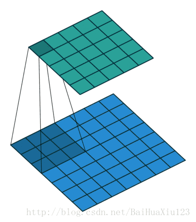
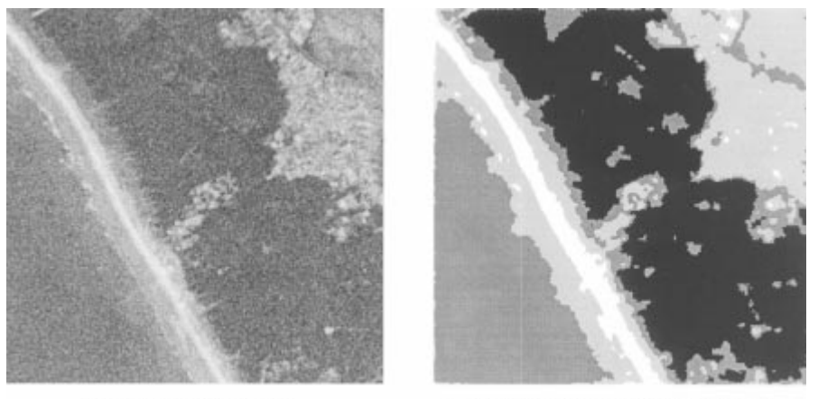

Problems Formulation in Ultra-Dense Networks Environment
---

<!--
在移动用户爆炸性的流量需求的推动下，超密网络必然成为移动用户的首选接入网络。由于网络密度的急剧增长，经典网络资源分配技术不足以研究UND中的资源优化。由于网络的规模效应，有效的资源分配方案具有非常重要的现实意义。

近年来一些研究者已经提出了一些有效的解决方案[1][2][3]，采用凸优化，博弈论，图论，随机几何方法，随机优化，分组、聚类等方法取得了不错的成果，这些研究提供了在UDN环境下的资源分配的宝贵见解，但是，最佳的资源分配依赖于完美的用户状态信息（CSI，QSI。等）。这是十分困难的，尤其是在像UDN这种大型网络中，这将需要庞大的计算量和信令开销。节点为了获取最优效率反而消耗了大量资源。因此，需要研究一种不满足完美用户状态信息情况下的资源分配问题。

在UDN网络中，RA问题始终被解释为高度复杂的大规模优化问题[1], 通过用户信息对效率函数进行最优化。随着越来越多的研究者意识到访问完美CSI信息即费时又在技术上是不可能的。机会约束优化受到了极大的关注[1][2][3]. 机会约束规划主要特点是约束条件中含有随机参数，这解决了无法获取完美CSI信息的问题。在[2]中考虑了具有不完善CSI的JPAC问题，文中将Jpac问题公式化为机会受限程序，其中每个链接的SINR中断概率被强制小于或等于指定的容差。[200]讨论了鲁邦的波束成形问题，该问题可以最大程度上的减少受SINR约束的发射功率消耗。尽管他们具有有趣的分析视角，但现有工作扔仅限于传统的网络，无法解决具有海量设备的UDN网络所面临的问题。
-->
### The topic is to solve the problem of Ultra-Dense Networks resource allocation optimization under imperfect CSI.
Driven by the explosive traffic demand of mobile users, Ultra-Dense Network (UDN) becomes the preferred access network for mobile users. However，due to the rapid increase in network density, classical network Resource Allocation (RA) techniques aren't sufficient to study resource optimization in Ultra-Dense Networks. An effective and robust resource allocation scheme is required.

In recent years, some researchers have proposed some effective solutions [1]-[6], Adopting some approaches like convex optimization, game theory, graph theory, stochastic geometry methods, stochastic optimization, grouping/clustering method, etc. As a result, these studies provide valuable insights into resource allocation in the UDN environment, but optimal resource allocation relies on perfect user state information (CSI, QSI, etc.). This is very difficult, especially in large networks like UDN, which will require a lot of signaling overhead. Nodes consume a lot of resources in order to get the best efficiency. it goes against the concept of RA which obtain the high energy efficiency. Therefore, it is necessary to study the resource allocation problem in the case of not satisfying the perfect user state information.

In the UDNs, the RA issues are always interpreted as a highly complex large-scale optimization problem[1], which optimizes the efficiency function through user information. As more and more researchers realize that accessing perfect CSI information is time consuming and technically impossible. Opportunistic constraint optimization has received great attention [4][5][6]. The main feature of the opportunity constrained programming is that the constraints contain random parameters, which solves the problem of not being able to obtain perfect CSI information. [[4]](https://ieeexplore.ieee.org/document/7434069) consider the joint power and admission control (JPAC) problem  with imperfect CSI. The JPAC problem is formulated as a chance-limited procedure in which the SINR outage probability of each link is forced to be less than or equal to the specified tolerance. [[5]](https://ieeexplore.ieee.org/document/5946309) discussed a robust beamforming problem, which minimizes the SINR-constrained transmit power consumption. Reference [[6]](https://ieeexplore.ieee.org/abstract/document/7876873) studies the transmit power minimization problem and the max-min fairness EH problem under both the bounded CSI error model and the probabilistic CSI error model. Despite their interesting analytical perspectives, existing work is limited to traditional networks and cannot solve the problems faced by UDN with massive devices.

[WIKI:Chance-constraint method](https://optimization.mccormick.northwestern.edu/index.php/Chance-constraint_method)  
CSI(channel state information)  

QSI(queue state information)  

**The bounded CSI error model** [[7]](https://ieeexplore.ieee.org/abstract/document/7876873)   

**The probabilistic CSI error model** [[7]](https://ieeexplore.ieee.org/abstract/document/7876873)

---

### Simplification of Ultra Dense Network in the case of millimeter waves
<!--超密集网络会带来很多好处，其中最主要的是能够使频谱在地理空间上复用，从而降低在单个基站上用户对资源的竞争，但是随着基站密度的增加，基站数量 n 趋近无穷。一些研究者通过平均场博弈理论[]-[]，将这一多体问题简化为一个单体在一个场下的行为简化了计算。但现有工作没有考虑到毫米波的视距传播特性。毫米波传播损耗具有指数路径衰落特性，所以这也给简化平均场模型带来了可能性。

本文提出的优化方法将平均场理解为一张动态涵噪声的图片，通过卷积和小波变换的方法对平均场分布进行滤波，压缩。以宏观的视角去寻求最优资源分配决策。
从图论的视角出发，本文提出的方法相当于用全局搜索的方法寻找最优网络分解，
-->

Ultra-dense networks will bring many benefits, the most important of which is the ability to reuse the spectrum in geographical space, thereby reducing the competition for resources on a single base station.  Some researchers have simplified this many-body problem to a one-body problem under a field by simplifying the calculation through the mean-field game theory [8]-[10]. However, the existing work does not take into account the line-of-sight propagation characteristics of millimeter waves. The millimeter-wave propagation loss has an exponential path fading characteristic, so this also brings the possibility to simplify the mean-field model.

The optimization method proposed in this paper interpreted as the mean-field as a dynamic picture, and filters and compresses the mean-field distribution by convolution and wavelet transform. Seek optimal resource allocation decisions from a macro perspective.

Starting from graph theory, the method proposed in this paper is equivalent to giving a new network decomposition scheme.

<!--
在移动用户爆炸性的流量需求的推动下，超密网络必然成为移动用户的首选接入网络。由于网络密度的急剧增长，经典网络资源分配技术不足以研究UND中的资源优化。由于网络的规模效应，有效的资源分配方案具有非常重要的现实意义。

为了提高小区边缘用户的性能，已经对基站协调进行了广泛的研究[8]
近年来一些研究者已经提出了一些有效的解决方案[1][2][3]，在[1]的工作中结合了平均场博弈和Lyapunov控制理论来解决联合功率分配和用户调度问题。将能源效率管理定义为随机微分优化问题，而用户调度部分则基于lypunov DPP方法解决了队列感知随机优化问题。在[2]从网络分解的角度，通过寻找最优的网络图分解，将网络图划分为一定数量的子图，从而降低了网络尺度，进而降低了计算复杂度。在[3]使用随机几何模型，对los和Nlos信道衰落建模，计算覆盖率和容量。这些研究提供了在UDN环境下的资源分配的宝贵见解，但是，最佳的资源分配依赖于完美的用户状态信息（CSI，QSI。等）。这是十分困难的，尤其是在像UDN这种大型网络中，这将需要庞大的计算量和信令开销。节点为了获取最优效率反而消耗了大量资源。因此，需要研究一种只获取部分用户状态信息情况下的资源分配问题。
-->
<!--
### Old Version
Driven by the explosive traffic demand of mobile users, ultra-dense networks must become the preferred access network for mobile users. Due to the rapid increase in network density, classical network resource allocation techniques are not sufficient to study resource optimization in UND. Due to the scale effect of the network, an effective resource allocation scheme has very important practical significance.

In recent years, some researchers have proposed some effective solutions [1][2][3]. In the work of [[2]](https://ieeexplore.ieee.org/abstract/document/7439746), the average field game and Lyapunov control theory are combined to solve the joint power allocation and user scheduling problems. Energy efficiency management is defined as a stochastic differential optimization problem, while the user scheduling part solves the queue-aware stochastic optimization problem based on the Lypunov DPP method. In [2] from the perspective of network decomposition, by finding the optimal network graph decomposition, the network graph is divided into a certain number of subgraphs, thereby reducing the network scale and thus reducing the computational complexity. The los and Nlos channel fading was modeled using a stochastic geometric model in [3] to calculate coverage and capacity. These studies provide valuable insights into resource allocation in a UDN environment, but optimal resource allocation relies on perfect user state information (CSI, QSI, etc.). This is very difficult, especially in large networks like UDN, which will require huge computational and signaling overhead. Nodes consume a lot of resources in order to get the best efficiency. Therefore, it is necessary to study a resource allocation problem in the case where only partial user status information is acquired.
-->

---

### Reference
[1]  Teng, Yinglei, et al. "Resource allocation for ultra-dense networks: A survey, some research issues and challenges." IEEE Communications Surveys & Tutorials (2018).  

[2] Samarakoon, Sumudu, et al. "Ultra dense small cell networks: Turning density into energy efficiency." IEEE Journal on Selected Areas in Communications 34.5 (2016): 1267-1280.

[3] Dai, Lin, and Bo Bai. "Optimal decomposition for large-scale infrastructure-based wireless networks." IEEE Transactions on Wireless Communications 16.8 (2017): 4956-4969.

[4] Y.-F. Liu, M. Hong, E. Song, "Sample approximation-based deflation approaches for chance SINR-constrained joint power and admission control", IEEE Trans. Wireless Commun., vol. 15, no. 7, pp. 4535-4547, Jul. 2016.

[5] K.-Y. Wang, T.-H. Chang, W.-K. Ma, A. M.-C. So, C.-Y. Chi, "Probabilistic SINR constrained robust transmit beamforming: A Bernstein-type inequality based conservative approach", Proc. IEEE Int. Conf. Acoust. Speech Signal Process. (ICASSP), pp. 3080-3083, May 2011.

[6] K.-Y. Wang, T.-H. Chang, W.-K. Ma, A. M.-C. So, C.-Y. Chi, "Probabilistic SINR constrained robust transmit beamforming: A Bernstein-type inequality based conservative approach", Proc. IEEE Int. Conf. Acoust. Speech Signal Process. (ICASSP), pp. 3080-3083, May 2011.

[7] Zhou, F., Li, Z., Cheng, J., Li, Q., & Si, J. (2017). Robust AN-aided beamforming and power splitting design for secure MISO cognitive radio with SWIPT. IEEE Transactions on Wireless Communications, 16(4), 2450-2464.

[8] Samarakoon, Sumudu, et al. "Ultra dense small cell networks: Turning density into energy efficiency." IEEE Journal on Selected Areas in Communications 34.5 (2016): 1267-1280.

[9] Abuzainab, N., Saad, W., & MacKenzie, A. B. (2019). Distributed Uplink Power Control in an Ultra-Dense Millimeter Wave Network: A Mean-field Game Approach. IEEE Wireless Communications Letters.

[10] De Mari, Matthieu, et al. "Joint stochastic geometry and mean field game optimization for energy-efficient proactive scheduling in ultra dense networks." IEEE Transactions on Cognitive Communications and Networking 3.4 (2017): 766-781.
