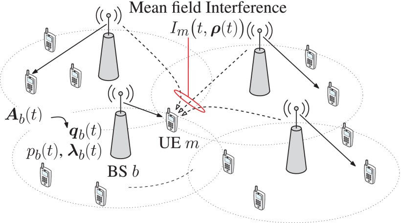

## Energy efficiency optimization of ultra-density networks using imperfect CSI

---

### Describe the Problem

In order to obtain the best energy efficiency in the ultra-dense network environment, a large amount of Channel State Information(CSI) needs to be obtained. The huge amount of signaling overhead will reduce energy efficiency and cause processing delays[[1]](https://ieeexplore.ieee.org/abstract/document/8329619). The author in [[2]](https://ieeexplore.ieee.org/document/7439746) transformed the multi-body optimization problem into the optimization problem of the single body in the average field through the average field game, effectively reducing the computational complexity. [[3]](https://ieeexplore.ieee.org/abstract/document/8247283)The user-centric cluster is adopted to reduce the computational complexity, while the incomplete CSI is considered to reduce the heavy channel training overhead.

>1. The Mean Field Game is a distributed optimization algorithm, but it requires every BS's CSI, without considering the situation of imperfect CSI.
>2. In order to obtain the Mean Field Distribution, a large amount of signaling overhead is needed to delay the system response.

3. The user density under each base station is different, and there may be no users under some base stations. It is not meaningful to consider the mean field distribution in this part.

4. According to the channel exponential attenuation characteristic, only a few Base Stations(BS) that are closer to the principal component of the mean field distribution function of the BS, the Mean Field effect of the BS that are far away can be approximated by a fixed distribution. This is like long-term and short-term benefits in reinforcement learning.

5. CSI can be divided into long-term characteristics and short-term characteristics. The CSI entropy is calculated when the CSI is feedback and transmitted when it exceeds a certain threshold, otherwise the CSI is not feedback. Other BSs use estimates for calculations.[[5]](https://ieeexplore.ieee.org/abstract/document/6404011)

ultra-density network Base Stations(BS) can be abstracted as a process of mutual learning and gaming between **homogeneous agents**[[4]](https://arxiv.org/pdf/1802.05438.pdf).

### Reference
[1]  Popovski, Petar, et al. "Wireless access for ultra-reliable low-latency communication: Principles and building blocks." Ieee Network 32.2 (2018): 16-23.

[2] Samarakoon, Sumudu, et al. "Ultra dense small cell networks: Turning density into energy efficiency." IEEE Journal on Selected Areas in Communications 34.5 (2016): 1267-1280.

[3] Pan, Cunhua, et al. "Joint pilot allocation and robust transmission design for ultra-dense user-centric TDD C-RAN with imperfect CSI." IEEE Transactions on Wireless Communications 17.3 (2018): 2038-2053.

[4] Yang, Yaodong, et al. "Mean field multi-agent reinforcement learning." arXiv preprint arXiv:1802.05438 (2018).

[5] Elizondo, Victor M., and Milan S. Derpich. "Maximum expected rates of block-fading channels with entropy-constrained channel state feedback." IEEE Transactions on Communications 61.2 (2013): 576-589.
