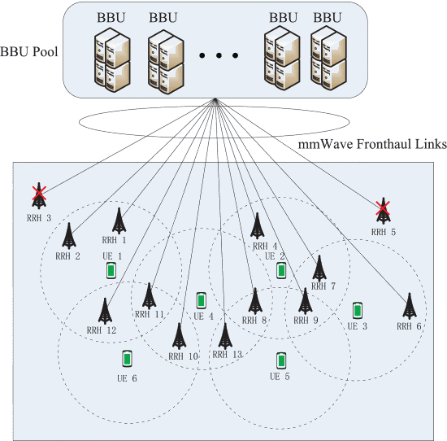
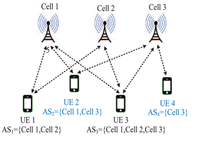

## Energy Efficient of Multi-Connectivity in Ultra Dense Networks
---

### Introduction

High-Capacity and Ultra-reliable communication are the research focus of current wireless communication networks. A simple and effective way to provide ultra-high resource reuse factors is the ultra-dense deployment of the system framework with Millimeter wave frequencies. The ultra-dense deployment of Base Station(BS) will cause frequent switching of user equipment(UE) between cells, and links in mmWave networks are highly susceptible to blocking and may suffer from rapid variations in quality. However, Radio link failures and service interruption times in a multi-connectivity session can be reduced or ideally avoided by means of simultaneous connections of multiple BSs.

multi-connectivity provides user-centric services and a reliable connection method to deal with the dynamic network environment, which facilitates a smoother and more stable network experience for mobile users. multi-connectivity can increase the user average throughput at low user density scenarios[1]. as in [2]-[3], in Multi-connectivity, reasonable management of the serving cell enables improvement in mobility robustness. In Research on energy efficiency，[5] expressed spectrum and energy efficiency of UDNs with stochastic geometry and also showed the improvements and limitations of network densification. Other works focus on new cell association schemes for HetNets and UDNs, such as [6]-[7]. However, The above work focuses on the robustness of the connection or the energy consumption in the case of a single Connectivity and does not consider the energy consumption in the case of multiple Connectivity in an ultra-density network. My research questions will focus on energy efficiency under multiple Connectivity in heterogeneous networks with millimeter-wave units.

The energy consumption minimization problem is formulated as a joint Problem of Multi-connectivity scheduling and power control.

### system Model

#### Transmission Model

### Problem Formulation

---
### Reference

[1] Ba, Xinran, et al. "Performance Comparison of Multi-Connectivity with CoMP in 5G Ultra-Dense Network." 2018 IEEE 87th Vehicular Technology Conference (VTC Spring). IEEE, 2018.

[2] Ba, Xinran, and Yafeng Wang. "Load-aware cell select scheme for multi-connectivity in intra-frequency 5G ultra dense network." IEEE Communications Letters 23.2 (2019): 354-357.

[3] Tesema, Fasil Berhanu, et al. "Evaluation of context-aware mobility robustness optimization and multi-connectivity in intra-frequency 5G ultra dense networks." IEEE Wireless Communications Letters 5.6 (2016): 608-611.

[4] Poirot, Valentin, et al. "Energy efficient multi-connectivity algorithms for ultra-dense 5G networks." Wireless networks (2019): 1-16.

[5] Li, Q., Wu, G., & Hu, R. Q. (2013). Analytical study on network spectrum efficiency of ultra dense networks. In 2013 IEEE 24th Annual International Symposium on Personal, Indoor, and Mobile Radio Communications (PIMRC). IEEE.

[6] Sun, Yang, et al. "A cluster-based hybrid access strategy using non-cooperative game theory for ultra-dense HetNet." 2015 IEEE 17th International Conference on High Performance Computing and Communications, 2015 IEEE 7th International Symposium on Cyberspace Safety and Security, and 2015 IEEE 12th International Conference on Embedded Software and Systems. IEEE, 2015.

[7] Zhang, Tiankui, et al. "Energy efficiency of base station deployment in ultra dense HetNets: A stochastic geometry analysis." IEEE Wireless Communications Letters 5.2 (2016): 184-187.
