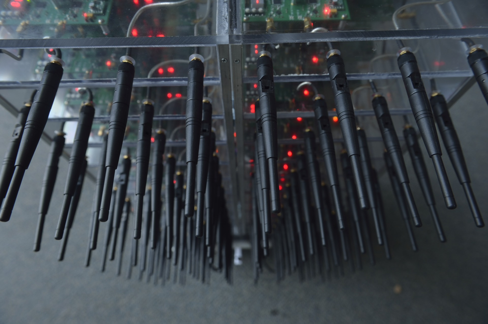
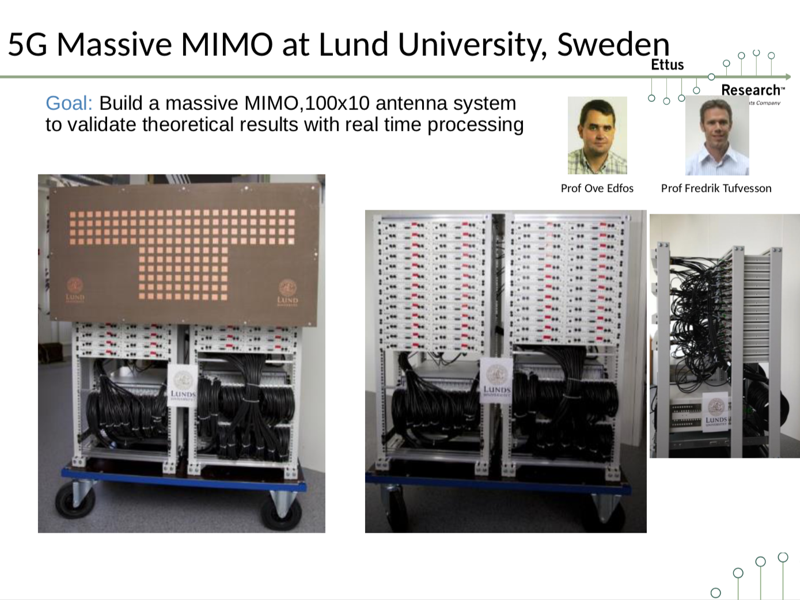
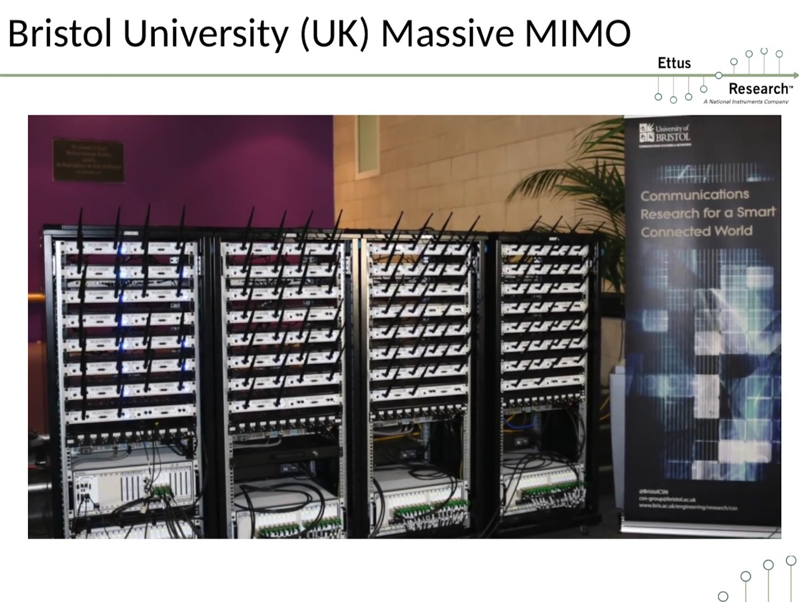

# Weekly Report 2

[toc]

### A university with a large 'SDR testbed' in the world
#### [Rice University](http://argos.rice.edu/#Photos)

 

#### [lund University](https://www.lunduniversity.lu.se/search?tab=publications&query=mimo&page=1&filter=LupfilterByGenreen-Journal%20article_LupfilterByConstituent-yes)

#### [University of bristol](https://www.bristol.ac.uk/engineering/research/smart/5g-demonstrations/massive-mimo/)

#### [Rutgers University](https://www.orbit-lab.org/)
[[github]](https://github.com/Wimnet/flexicon_orbit) [[Columbia FlexICoN]](https://flexicon.ee.columbia.edu/)

---
### executed projects on testbed
[1] [Zhang, Changchun, and Robert C. Qiu. "Massive MIMO as a big data system: Random matrix models and testbed." IEEE access 3 (2015): 837-851.](https://ieeexplore.ieee.org/stamp/stamp.jsp?arnumber=7112627)

[2]  [Vinogradova, Julia, Emil Björnson, and Erik G. Larsson. "Detection and mitigation of jamming attacks in massive MIMO systems using random matrix theory." 2016 IEEE 17th International Workshop on Signal Processing Advances in Wireless Communications (SPAWC). IEEE, 2016.](https://ieeexplore.ieee.org/stamp/stamp.jsp?arnumber=7536868)

[3] [Github GPS-SDR-SIM](https://github.com/osqzss/gps-sdr-sim)

[4] [OFDM programs for USRP UHD version](https://github.com/UpYou/ofdm)
