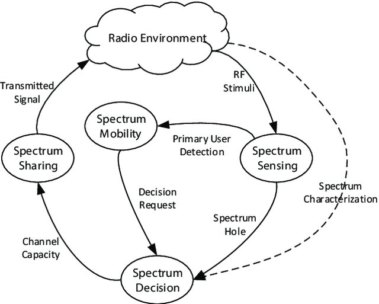
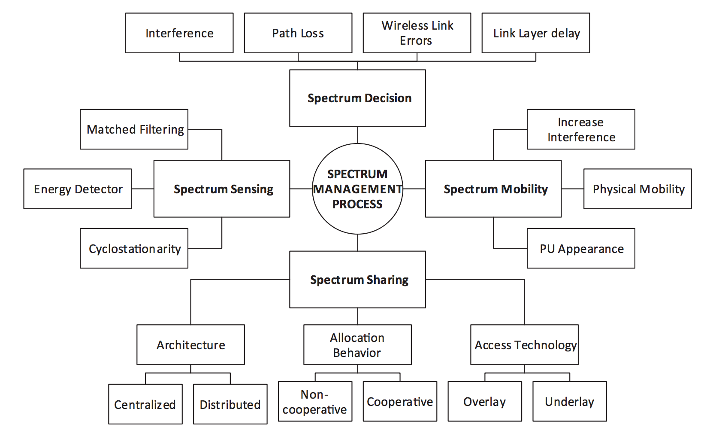
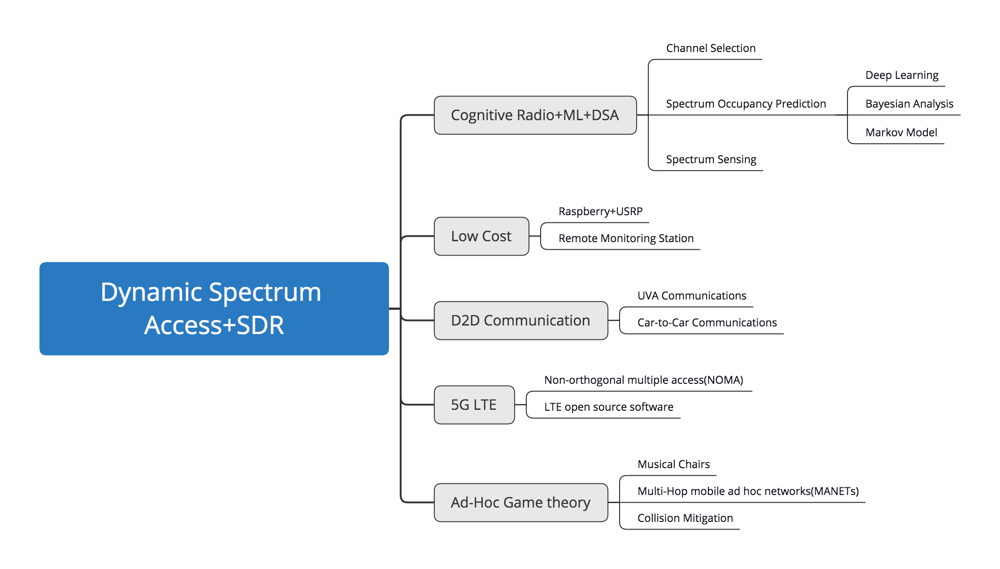

# SDR Testbed in Dynamic Spectrum Access and Cognitive Radio

### Dynamic Spectrum Access(DSA)

Dynamic spectrum access is the process of increasing spectrum efficiency via the real-time adjustment of radio resources. In the same frequency range, there are two co-existing systems: primary system and secondary system. Primary system refers to the licensed system with legacy spectrum. This system has the exclusive privilege to access the assigned spectrum. Secondary system refers to the unlicensed cognitive system and can only opportunistically access the spectrum holes which are not used by the primary system. We call the subscriber in the primary system as Primary User (**PU**) and the subscriber in the secondary system as Secondary User (**SU**). The SUs are able to dynamically access the licensed frequency bands without any modification to the primary system.

:pectrum users sharing spectrum access on **negotiated** or **opportunistic** strategies.The most research area is Opportunistic Spectrum Access(**OSA**)[[1]](#id1)

### Cognitive Radio Functions
Four of the most important CR functions for spectrum control are: spectrum mobility, spectrum sensing, spectrum sharing, and spectrum decision.[[2]](#id2)
* ***Spectrum Sensing***: - Spectrum sensing supports to detect the spectrum holes providing high spectral resolution capability.Spectrum sensing techniques are classified into three categories: **Transmitter detection**, **Cooperative detection** and **Interference based detection**.
*  ***Spectrum mobility***: - Spectrum mobility is defined as the process when a cognitive radios users exchange its frequency of operation.
* ***Spectrum sharing***: - Spectrum sharing is function of cognitive radio which provides the fair spectrum scheduling method.
* ***Spectrum decision***: - Spectrum decision is the ability of a cognitive radio (CR) to select the best available spectrum band to satisfy secondary users’ (SUs’) quality of service (QoS) requirements, without causing harmful interference to licensed or primary users (PUs).

Figure 1. The Cognitive  Cycle

Cognitive Radios technology enables spectrum sharing without causing harmful interference to existing traffics, cognitive users should possess a minimum of information about their surrounding non-cognitive users. cognitive radio approaches fall into three classes: Underlay, Overlay and Interweave.

**Underlay approach**: -  Simultaneous SU and PU transmissions are allowed as long as the interference level at the PU side remains acceptable. Exceeding the predefined tolerable interference threshold may degrade dramatically the primary signal. A common solution is the **Spread Spectrum Technique** and **limiting the power** of the secondary signal

**Overlay approach**: - In this approach, PU share knowledge of their signal codebooks and messages with the SU. SU overheard the messages by PU and forward the messages to improve the SINR of the PU, This will improve the PU's SINR. or SU will serve itself as a **relay node**, and encode the data of SU to the messages of PU.

**Interweave approach**: - interweave approach is also called Opportunistic Spectrum Access (**OSA**). This spectral coexistence approach in the objective of enabling devices to occupy the spectrum rooms that have been left vacant by PU. the secondary user can access portions of the spectrum that are considered underutilized as long as the primary activity remains idle

Figure 2. Cognitive Radios process

### DSA Research Direction

- Anti-interference
- Improve spectrum utilization
- Maximize throughput
- Fairness
- Time delay
- Minimize energy consumption
- Network connectivity

### Survey of Implementation DSA on SDR Testbed

Figure 3. Implementation DSA on SDR Testbed

#### CR+ML+DSA
> Channel Selection
>>The proposed algorithms in the paper[[4]](https://ieeexplore.ieee.org/stamp/stamp.jsp?arnumber=6554535) allow allocating channels with up to 6dB better quality and 4% higher efficiency than Q-Learning.

> Spectrum Occupancy Prediction
>>*Deep Learning* [5] Convolutional Neural Network (CNN) and Long Short Term Memory (LSTM) are adopted and designed. They are trained using real RF traces for different coexisting scenarios collected from a USRP based testbed to identify the presence of signals with varying levels of Signal to Noise Ratio,

>>*Bayesian Analysis*[6]Bayesian are compared for their prediction performance and the computational complexity, with other approaches based on the exponentially weighted moving average(EWMA), Hidden Markov Models (HMM), and Neural Networks, its performance is also superior to other methods.

>>*Markov Model*[7]In a coordinated multi-SU/PU scenario, compared to the traditional random Carrier Sense Multiple Access (CSMA), the proposed HSMM-dynamic spectrum allocation (DSA) protocol significantly reduces aggregate interference to PU

>Spectrum Sensing
>>[[8]](https://itra.medialabasia.in/data/Documents/Cognitive%20Radio/publications/2018_02_27_10_30FA1P3I-Hardware%20Implementation%20of%20K-means%20Clustering_LNMIIT.pdf)Improve Energy detection based spectrum sensing using K-means clustering method and realize by USRP. Achieving Energy detection method for spectrum sensing

#### Low Cost
>Raspberry+USRP
>>[[9]](https://www.researchgate.net/profile/Soumaya_El_Barrak3/publication/326398846_Implementation_of_a_low_cost_SDR-based_Spectrum_Sensing_Prototype_using_USRP_and_Raspberry_Pi_board/links/5c900f2292851c1df94a58df/Implementation-of-a-low-cost-SDR-based-Spectrum-Sensing-Prototype-using-USRP-and-Raspberry-Pi-board.pdf)It is carried out using ‘USRP (Universal Software Radio Peripheral) and GNURadio’ Software Defined Radio (SDR) platform, implemented on a single board computer, which is the Raspberry Pi 3 board.

>Remote Monitoring Station
>>[10-11]he articles propose a feasible architecture of spectrum monitoring in which a control center is built using GNU Radio platform; some remote monitoring stations are built with SDR devices. Through TCP/IP network, measurement results or complex sampled data from the SDR devices can be sent to the monitoring center.

#### D2D Communication
>UVA Communications
>>[12] This paper attempts to study the remote control signal of UAV from signal collection and analysis. Firstly, remote control signals for the typical civilian small UAV are received and analyzed based on the GNU Radio and USRP X310. Afterward, get the related parameters such as bandwidth, period and frequency hopping sequence, Finally, the command signal is parsed out.

>> In reference [[13]](https://www.researchgate.net/profile/Karthik_Vasudeva/publication/301404188_UAV-based_GSM_network_for_public_safety_communications/links/576610e908ae1658e2f4aa26.pdf) present an unmanned aerial vehicle (UAV) based software-defined radio (SDR) platform which can be rapidly deployed for use in emergency communication scenarios. In particular, the UAVs serve as flying GSM base stations and can provide cellular network coverage to users within their vicinity.

>>in [[14]](https://digitalcommons.wpi.edu/cgi/viewcontent.cgi?article=8114&context=mqp-all)，they team designed an RSS-Based 3D localization system utilizing software-defined radio. detecting and quantifying the received signal strength of the video stream emitted by the drone to the remote controller. The adaptive filtering algorithm, recursive least squares, was used to numerically estimate the drone's 3D position.

>Vehicle-to-everything(V2X) Communications
>>In the paper[15-16] present a 5G Vehicle-to-everything (V2X) wireless testbed based on flexible and reconfigurable software-defined radio that is designed for cooperative automated driving. The main building blocks of the testbed include a reconfigurable RF front-end and optimized base-band processing on general purposed CPUs.

#### 5G LTE
>Non-orthogonal multiple access(NOMA)
>>[17-20]Implement a practical downlink NOMA system based on an open-source software defined radio (SDR) platform named as OpenAirInterface (OAI).

LTE open source software
>[a] Open Air Interface-OAI  [https://www.openairinterface.org/](https://www.openairinterface.org/)

>[b] SoftwareRadioSystems- srsLTE  [http://www.softwareradiosystems.com/](http://www.softwareradiosystems.com)

>[c] OpenLTE  [http://openlte.sourceforge.net/](http://openlte.sourceforge.net/)

#### Ad-Hoc Game theory
>Musical Chairs
>>[21-22]describes  DSA in ad hoc as a multi-player multi-armed Bandit problem and develops distributed algorithm which allows SUs to orthogonalize in optimal channels with a negligible number of collisions.

>>[23]The authors studied the distributed algorithm for malicious behavior (interference attack) under the denial of service attack, and setup the problem as a multiplayer bandit and develop distributed learning algorithms.

>Multi-Hop mobile ad hoc networks(MANETs)
>>[3]The paper describes the MANET Cognitive Radio test bed. The proposed architecture consists of a number of CR nodes connected to the RF Switch Matrix, and enables simulation, scenario definition and management.

>Collision Mitigation
>>[24-27]based on multi-armed bandit (MAB) learning approaches has been proposed to support the increasing number of devices in IoT networks in unlicensed bands. In the present work, a GNU radio framework is implemented to recreate an IoT network where IoT devices embedding MAB algorithms are able to learn the availability of the channels for their packet transmissions to the gateway. The experimental results show that the introduction of decentralized learning mechanism in access schemes can improve the performance of the IoT devices, both in terms of energy consumption and spectrum overload, thanks to radio collision mitigation.

### References
[1] [Facilitating Opportunities for Flexible, Efficient, and Reliable Spectrum Use Employing Cognitive Radio Technologies](https://www.fcc.gov/document/facilitating-opportunities-flexible-efficient-and-reliable-spectrum-1)

[2] [Medium Access Control Protocols for Cognitive Radio Ad Hoc Networks: A Survey](hhttps://www.researchgate.net/profile/Leyre_Azpilicueta/publication/319878902_Medium_Access_Control_Protocols_for_Cognitive_Radio_Ad_Hoc_Networks_A_Survey/links/59bfcd56458515e9cfd532d8/Medium-Access-Control-Protocols-for-Cognitive-Radio-Ad-Hoc-Networks-A-Survey.pdf)

[3] Gajewski, Piotr, and Jerzy Lopatka. "MANET Cognitive Radio realtime testbed for dynamic spectrum access." 2017 IEEE AFRICON. IEEE, 2017.

[4] Faganello, Leonardo Roveda, et al. "Improving reinforcement learning algorithms for dynamic spectrum allocation in cognitive sensor networks." 2013 IEEE Wireless Communications and Networking Conference (WCNC). IEEE, 2013.

[5] Omotere, Oluwaseyi, et al. "Spectrum Occupancy Prediction in Coexisting Wireless Systems Using Deep Learning." 2018 IEEE 88th Vehicular Technology Conference (VTC-Fall). IEEE, 2018.

[6]Jacob, Jaison, Babita R. Jose, and Jimson Mathew. "Bayesian analysis of spectrum occupancy prediction in cognitive radio." Smart Science 4.2 (2016): 52-61.

[7] Koley, S., D. Bepari, and D. Mitra. "Predictive Multi-user Dynamic Spectrum Allocation Using Hidden Semi-Markov Model." Journal of Communications Technology and Electronics 63.12 (2018): 1393-1405.

[8] Agarwal, Anirudh, et al. "Hardware implementation of k-means clustering based spectrum sensing using usrp in a cognitive radio system." 2017 International Conference on Advances in Computing, Communications and Informatics (ICACCI). IEEE, 2017.

[9] El Barrak, Soumaya, et al. "Implementation of a low cost SDR-Based Spectrum sensing Prototype Using USRP and Rasbperry Pi Board." Proceedings of Engineering and Technology-PET 20 (2017): 54-58.

[10] Bósquez, Carlos, Alex Calderón, and Jorge Guapacasa. "Low-Cost remote monitoring station from standard ISDB-Tb of DTT using SDR." 2017 IEEE XXIV International Conference on Electronics, Electrical Engineering and Computing (INTERCON). IEEE, 2017.

[11] Chen, Wen-Tzu, Ku-Tung Chang, and Chung-Pao Ko. "Spectrum monitoring for wireless TV and FM broadcast using software-defined radio." Multimedia Tools and Applications 75.16 (2016): 9819-9836.

[12] Tian, Yong, Zulin Wang, and Qin Huang. "UAV Remote Control Signal Analysis Based on GNU Radio and USRP X310." 2018 2nd IEEE Advanced Information Management, Communicates, Electronic and Automation Control Conference (IMCEC). IEEE, 2018.

[13] Guevara, K., et al. "UAV-based GSM network for public safety communications." SoutheastCon 2015. IEEE, 2015.

[14] Hassan, Abdul Ali, Ian Solomon Gelman, and John Patrick Loftus. "Adversary UAV Localization With Software Defined Radio." (2019).

[15] Cao, Hanwen, et al. "A 5G V2X testbed for cooperative automated driving." 2016 IEEE Vehicular Networking Conference (VNC). IEEE, 2016.

[16] Cao, Hanwen, et al. "A testbed for experimenting 5G-V2X requiring ultra reliability and low-latency." WSA 2017; 21th International ITG Workshop on Smart Antennas. VDE, 2017.

[17] Xiong, Xiong, et al. "An open source SDR-based NOMA system for 5G networks." IEEE Wireless Communications 22.6 (2015): 24-32.

[18] Wei, Xingguang, et al. "Software defined radio implementation of a non-orthogonal multiple access system towards 5G." IEEE Access 4 (2016): 9604-9613.

[19] Wei, Xingguang, et al. "A portable sdr non-orthogonal multiple access testbed for 5g networks." 2017 IEEE 85th Vehicular Technology Conference (VTC Spring). IEEE, 2017.

[20] Xiong, Qi, et al. "Advanced NoMA scheme for 5G cellular network: Interleave-grid multiple access." 2017 IEEE Globecom Workshops (GC Wkshps). IEEE, 2017.

[21] Joshi, Himani, et al. "Distributed algorithm for dynamic spectrum access in infrastructure-less cognitive radio network." 2018 IEEE Wireless Communications and Networking Conference (WCNC). IEEE, 2018.

[22] Kumar, Rohit. "Distributed algorithms for opportunistic spectrum access in decentralized cognitive radio network." 2018 10th International Conference on Communication Systems & Networks (COMSNETS). IEEE, 2018.

[23] Sawant, Suneet, et al. "Distributed learning algorithms for coordination in a cognitive network in presence of jammers." 2018 16th International Symposium on Modeling and Optimization in Mobile, Ad Hoc, and Wireless Networks (WiOpt). IEEE, 2018.

[24]L. Besson, “SMPyBandits: an Open-Source Research Framework for
Single and Multi-Players Multi-Arms Bandits (MAB) Algorithms in
Python”: https://GitHub.com/SMPyBandits/SMPyBandits
https://SMPyBandits.GitHub.io/

[25] Moy, Christophe, and Lilian Besson. "Decentralized Spectrum Learning for IoT Wireless Networks Collision Mitigation." arXiv preprint arXiv:1906.00614 (2019).

[26] Manco-Vasquez, Julio, Christophe Moy, and Faouzi Bader. "GNU Radio implementation for Multiuser Multi-Armed Bandit learning algorithms in IoT networks." 2019.

[27]Narayanan, Revathy, and Swarun Kumar. "Revisiting software defined radios in the IoT era." Proceedings of the 17th ACM Workshop on Hot Topics in Networks. ACM, 2018.

**A Survey**

[28] Yadav, Pinki, Subhajit Chatterjee, and Partha Pratim Bhattacharya. "A survey on dynamic spectrum access techniques in cognitive radio." International Journal of Next-Generation Networks 4.4 (2012): 27.

[29] Benmammar, Badr, Asma Amraoui, and Francine Krief. "A survey on dynamic spectrum access techniques in cognitive radio networks." (2013).

[30] Masonta, Moshe Timothy, Mjumo Mzyece, and Ntsibane Ntlatlapa. "Spectrum decision in cognitive radio networks: A survey." IEEE Communications Surveys & Tutorials 15.3 (2012): 1088-1107.

[31] Zareei, Mahdi, et al. "Medium access control protocols for cognitive radio ad hoc networks: A survey." Sensors 17.9 (2017): 2136.

[32] Ren, Pinyi, et al. "A survey on dynamic spectrum access protocols for distributed cognitive wireless networks." EURASIP Journal on Wireless Communications and Networking 2012.1 (2012): 60.

[33] Sandya, H. B., K. Nagamani, and L. Shavanthi. "A Review of Cognitive Radio Spectrum Sensing Methods in Communication Networks." 2018 International Conference on Communication and Signal Processing (ICCSP). IEEE, 2018.
