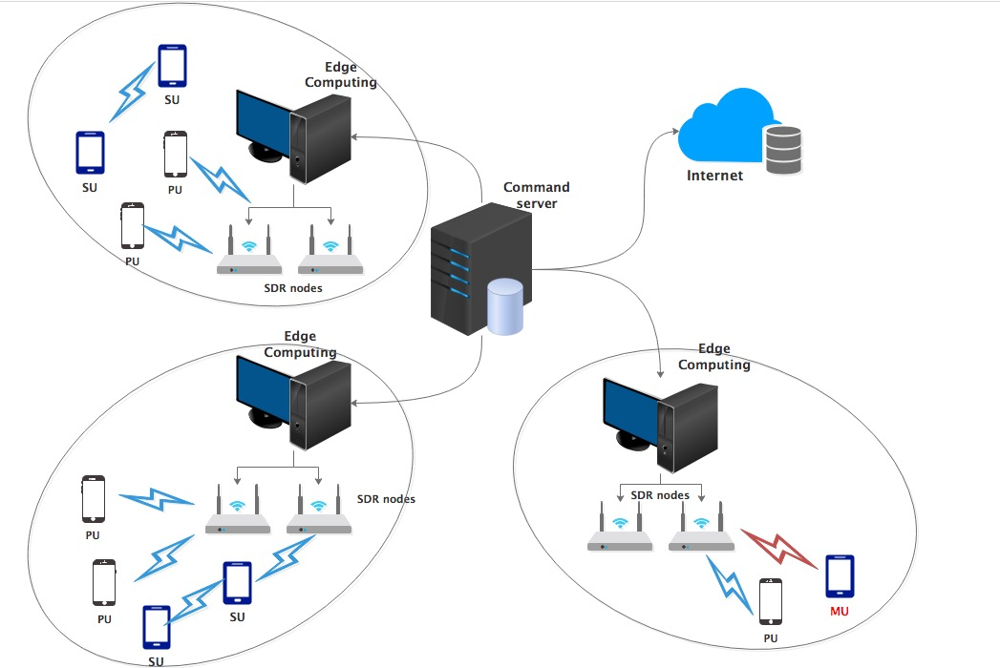
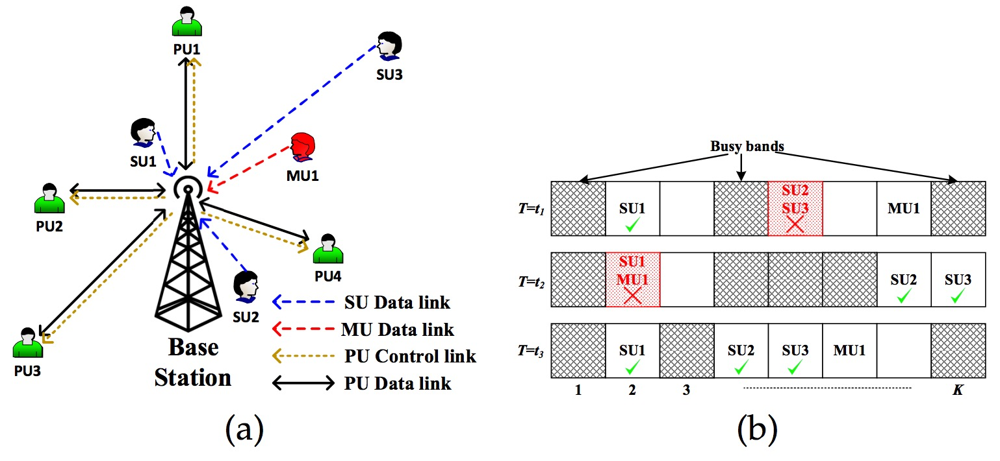
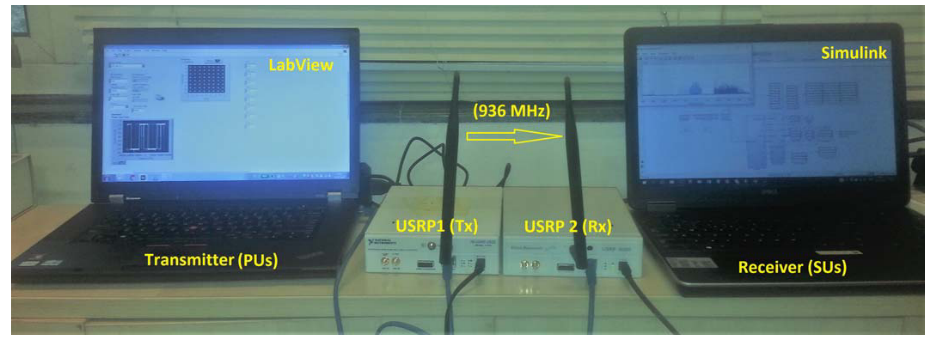
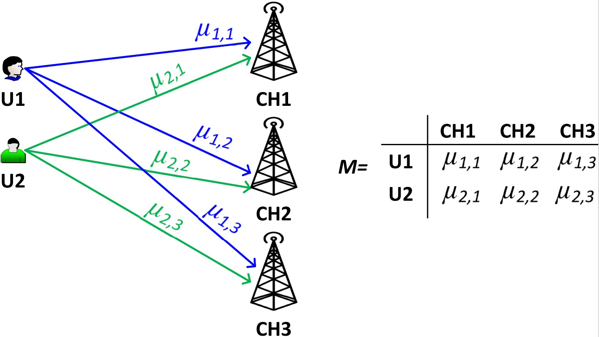
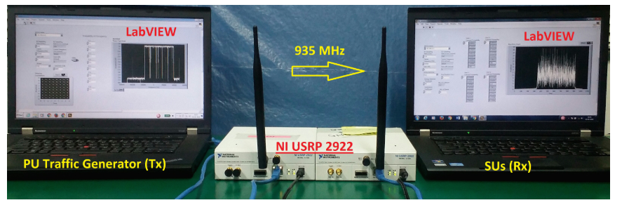

## The purpose of establishing USRP testbed is to validate new theories and protocols in a real-world environment.
----
### Current Status:
- **More research on large-scale SDR Testbed at the physical layer.**[[1-5]](#id)(MU-MIMO, Full-Duplex Transmission)
- **Distributed SDR testbed is mostly to do wireless sensor.**[[6-10]](#id)(Positioning, Energy Detection, Channels Sounding, Synchronization)

### Our Advantage:

**1. There is no multi-node ultra-dense network Experimental system.**
>**Possible Reason:**
- One USRP node costs almost $3,000，and regularly 4-8 nodes is enough to build a MIMO system.
- Although there are enough nodes in Lund University or University of Bristol，since the nodes are fixed together, it is only suitable for the MIMO.

    

**2. Other researchers have only studied the number of SU nodes less than the number of channels because there are few nodes. in the future, there may be hundreds of SU nodes in one cell.**

### To do list:

**1. Set up a simple ultra-dense network demonstration system.**（maybe can write a paper on this demo）

Figure 1. Model implementation  of Edge Computing in Software-Defined Ultra-Dense Network

**2. When the number of nodes is greater than the number of channels, what is the best way to access?**

----
#### [Manjesh Kumar Hanawal](https://scholar.google.com/citations?hl=zh-CN&user=vtVK3KUAAAAJ&view_op=list_works&sortby=pubdate)

**Keywords:** *Opportunistic Spectrum Access*, *Multi-Player Bandit*, *Musical Chair*

**Software:** Labview

**Modulation:** OFDM

**USRP Model:** USRP-2922

#### 2019_Learning to Coordinate in a Decentralized Cognitive Radio Network in Presence of Jammers[[11]](https://ieeexplore.ieee.org/stamp/stamp.jsp?arnumber=8770293)

**The network Model:**

Figure 2. (a) The network Model, and (b) Status of frequency
bands at different time instant along with various collision
events.

malicious users (MUs).

**USRP Testbed：**

Figure 3. USRP Testbed in reference [1]

#### 2019_Distributed Learning and Optimal Assignment in Multiplayer Heterogeneous Networks[[12]](https://ieeexplore.ieee.org/stamp/stamp.jsp?tp=&arnumber=8737653)

**The Network Model:**

Figure 4.  A network with 2 users, 3 channels and rate matrix M

**USRP Testbed：**

Figure 5. USRP Testbed in reference [2]

---
### Ohter Researcher
[Dereje Assefa Wassie](https://scholar.google.com/citations?hl=zhCN&user=2pB2I2EAAAAJ&view_op=list_works&sortby=pubdate), Aalborg University, **Keywords:** Full-Duplex, Interference Suppression, Channel Sounding, Distributed Synchronization

[Adrian Kliks](https://scholar.google.com/citations?hl=zh-CN&user=52l_IewAAAAJ&view_op=list_works&sortby=pubdate), Poznan University of Technology, **Keywords:** Opportunistic Spectrum Access, Brain-Inspired, Database, DVB, HetNets,

[Kae Won Choi](https://ciot.skku.edu/), Seoul National University of Science and Technology, **Keywords:** IoT, Wireless Power Transfer,

**Rice University**

Adviser-[Lin Zhong](https://scholar.google.com/citations?hl=zh-CN&user=hJPN-G8AAAAJ&view_op=list_works&sortby=pubdate), **Keywords:** MU-MIMO, Channel Estimation, Full-Duplex Transmission

Post-doctoral-[Rahman Doost-Mohammady](https://scholar.google.com/citations?hl=zh-CN&user=kuJfCcsAAAAJ),

Ph.D.-[Clayton Shepard](https://scholar.google.com/citations?hl=zh-CN&user=uQXZx1gAAAAJ),

**Columbia University(ORBIT)**

Adviser-[Harish Krishnaswamy](http://cosmiccolumbia.com/), **Keywords:** millimetre wave circulators, CMOS integrated circuits, interference suppression

Ph.D.-[Tingjun Chen](https://scholar.google.com/citations?hl=zh-CN&user=RPmhP24AAAAJ)

PH.D.-[Mahmood Baraani Dastjerdi](https://scholar.google.com/citations?hl=zh-CN&user=Lz1eKC8AAAAJ)

---

### Memorandum

<https://scholar.google.com/citations?hl=zh-CN&user=2pB2I2EAAAAJ&view_op=list_works&sortby=pubdate>
<https://ieeexplore.ieee.org/author/37645975800>

##### Resource management in the context of wireless IoT may include several aspects[1](Game Theoretic Mechanisms for Resource Management in Massive Wireless IoT Systems)
• Spectrum allocation

• Power control

• Interference management

• Backhaul resource allocation

• Allocation of storage and computing resources in the cloud

### References

[1]Harris, Paul, et al. "A distributed massive MIMO testbed to assess real-world performance and feasibility." 2015 IEEE 81st Vehicular Technology Conference (VTC Spring). IEEE, 2015.

[2]Harris, Paul, et al. "LOS throughput measurements in real-time with a 128-antenna massive MIMO testbed." 2016 IEEE Global Communications Conference (GLOBECOM). IEEE, 2016.

[3]Yang, Xi, et al. "Design and implementation of a TDD-based 128-antenna massive MIMO prototype system." China Communications 14.12 (2017): 162-187.

[4]Chen, Tingjun, et al. "Demo abstract: Open-access full-duplex wireless in the ORBIT testbed." IEEE INFOCOM 2018-IEEE Conference on Computer Communications Workshops (INFOCOM WKSHPS). IEEE, 2018.

[5]Chen, Tingjun, et al. "Open-access full-duplex wireless in the ORBIT testbed." arXiv preprint arXiv:1801.03069 (2018).

[6]Monfared, Shaghayegh, et al. "Experimental demonstration of BLE transmitter positioning based on AOA estimation." 2018 IEEE 29th Annual International Symposium on Personal, Indoor and Mobile Radio Communications (PIMRC). IEEE, 2018.

[7]Jia, Wen-Kang, Yun Zheng, and Tain Sao Chang. "A fast spectrum sensing and revocation testbed based on USRP and GNU radio for cognitive radio networks." Proceedings of the 4th International Conference on Communication and Information Processing. ACM, 2018.

[8]Wassie, Dereje Assefa, et al. "An agile multi-node multi-antenna wireless channel sounding system." Ieee Access 7 (2019): 17503-17516.

[9] Özdemir, Özgür, et al. "Sparsity-aware joint frame synchronization and channel estimation: Algorithm and USRP implementation." MILCOM 2017-2017 IEEE Military Communications Conference (MILCOM). IEEE, 2017.

[10]Kramarev, Dmitry. "Accurate symbol-level synchronization of universal software radio peripherals for physical-layer network coding applications." MILCOM 2017-2017 IEEE Military Communications Conference (MILCOM). IEEE, 2017.

[11]Sawant, Suneet, et al. "Learning to Coordinate in a Decentralized Cognitive Radio Network in Presence of Jammers." IEEE Transactions on Mobile Computing (2019).

[12]Tibrewal, Harshvardhan, et al. "Distributed Learning and Optimal Assignment in Multiplayer Heterogeneous Networks." IEEE INFOCOM 2019-IEEE Conference on Computer Communications. IEEE, 2019.
