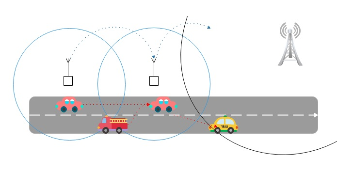
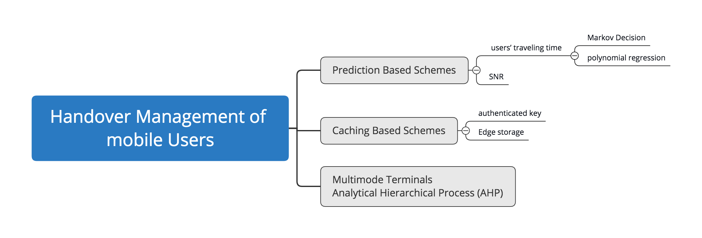

## The Topic: Handover Management of High-Speed Mobile Users in Ultra-Density Networks
----
### Motivation

As an important branch of the Internet of Things, the Internet of Vehicles is popular among users because it can relieve traffic pressure and help people to travel safely and conveniently. In the face of current heterogeneous high-density networks, vehicles will generate a large number of Handover decision during high-speed driving. To ensure the stability of the connection and low latency, it is necessary to find the best solution.The results of this research will be applied to UAV, high-speed trains etc.

Figure 1. Handover Management of Vehicular

----
### Related work

Figure 2. Related work

#### A. Dwell Timer Based Schemes(old)

Authors in [3] mainly concentrate on the micro- and macro-mobility solutions along with the description of related protocols. in [4] propose the design and a prototype of seamless handover mechanism for high speed vehicles using dynamic dwell timer. This scheme is designed for IEEE 802.11 networks and aims at reducing the handover delay for the provision of telemetry services. The proposed prototype consists of micro and macro cellular coverage areas that operate on same frequencies. According to authors, their proposed method circumvents all of the conventionally known handover phases to reduce overall handover latency. This is done by using a centralized Radio Control Unit (RCU) that tunes the dwell timer according to the coverage area and terminal speed and it also contains all the handover related information. As a mobile user enters a macro cell its handover needs are estimated by the RCU and transmitted to the neighboring RCUs. This helps in reducing packet loss due to advance packet buffering and also, reducing handover delay because of early binding.

#### B. Prediction Based Schemes
For reducing the number of unnecessary handovers, authors in [5] described a handover decision scheme that considers the time a mobile node is likely to spend within a WLAN. This mechanism is highly dependent on the assessment of users’ traveling time within a WLAN and the calculation of a time threshold. Handover towards a WLAN is initiated only if its coverage is present and if users’ estimated traveling time in that specific network is larger than the predefined time threshold. If a handover towards any cellular network is intended then it needs to qualify for two conditions: (1) RSS of the WLAN is constantly degrading and (2) MN has reached the cell boundary due to its high velocity and a handover needs to be initiated. This scheme saves disconnections, reduces unnecessary handovers and also, de- creases the probability of handover failures. However, higher handover delays are observed because authors utilize sampling and averaging of RSS which is a time consuming process.

Using a similar method in [6], [7], Chang et al. proposed a cross layer based polynomial regression predictive RSS scheme with the Markov Decision Process (MDP) based network selection for vertical handovers in heterogeneous wireless networks. The proposed scheme comprises of two phases i.e., (1) decision phase, where measurement of predictive RSS with a hysteresis value are carried out and (2) network selection phase, where an optimal target network, towards which a handover is intended, is determined. In the first phase, a polynomial regression based methodology is employed to forecast whether an MN moves closer to or away from a wireless network. Second phase determines the candidate access network with the lowest possible cost with the help of MDP for an optimal network selection for handover. The proposed approach achieves load balancing in the target networks and avoids unnecessary handovers while the wireless links are occupied for longer period that cause unnecessary handover delays and higher link utilization.

[8]proposes a novel adaptive fuzzy logic inference system to estimate and predict the probability information for direct sequence code division multiple access (DS/CDMA) wireless communications networks. The estimation is based on measured pilot signal strengths at the mobile user from a number of nearby base stations, and the prediction is obtained using the recursive least square (RLS) algorithm. Numerical results are presented to demonstrate the performance of the proposed technique under various path loss and channel shadowing conditions.

#### C. Caching Based Schemes
[9] bridges the trust relationship using a shared key across different networks. This shared key is normally sent to the candidate networks in advance. As a mobile node ascribes to a new network, it is directly authenticated using AAA proxy. This process helps in reducing packet loss as all the data is redirected to the new network in anticipation. Also, an MN is given the full control of keying information for rapid authentication which solves the issues of privacy and security like DoS and masquerading attacks to some extent as well.

#### D. Analytical Hierarchical Process (AHP)

with the emergence of multimode terminals where each mobile device can simultaneously connect to multiple networks. Pervaiz et al. consider heterogeneous wireless networks containing WLAN and WiMAX for vertical handover using AHP and game theoretical approaches [10]. They take into account the parameters of pricing, bit rate, user preferences and mobility. The proposed mechanism is totally dependant on location of the mobile user and configuration of the network for calculating the payoff of the handover as in [11]. Using this measured payoff, network selection is performed in order to better satisfy the mobile users. The main focus of the proposed approach is on the decision making process and maximizing cooperation of the mobile nodes with the network for user contentment. Similarly, [12] showed the implications of reputation-based game theoretical model for appropriate network selection. This work mainly focuses on improving the cooperation between network device and also, on identifying the user behaviors based on their previous experiences for an appropriate network selection and handover decision making process.

---

### An Introduction of UDN[1]
**A. Definitions of UDN**

>Ultra-Dense Networks can be defined as those networks where there are more cells than active users. In other words, , where  is the density of access points, and  is the density of users.  

>Another definition of UDN was solely given in terms of the cell density, irrespective of the users density. Ding et al. provided a quantitative measure of the density at which a network can be considered ultra-dense (≥ 103 cells/km2).

**B. Features of UDN**
1. A small coverage area, many small cells would be in a very close distance to the users.
2. Due to the high density of small cells, many small cells would be inactive.
3. Close proximity of the small cells to each other in UDN environments generates high interference.
4. Innovative frequency reuse techniques are required.
5. The backhaul of a small cell might be the bottleneck of its capacity, where the backhaul capacity would limit the air-interface capacity.
6. High probability of Line-of-Sight (LOS) transmissions.

**C. Modeling Techniques**
1. Game Theory
2. Stochastic Geometry
3. Mean-Field Games

**D. Performance Metrics**
1. **Success Probability and Outage Probability:** The probability that the SINR of a randomly selected user is above a certain threshold. In other words, the link quality is good enough to proceed to a successful connection.

2. **Rate Coverage and Rate Outage:** *Rate Coverage:* The probability that the achievable rate of an arbitrary user is above a certain minimum； *Rate Outage:* the probability that the achievable rate of an arbitrary user falls below a certain threshold.

3. **Average Spectral Efficiency:** The average number of transmitted bits per second per unit bandwidth represents the efficiency of the spectrum.

4. **Area Spectral Efficiency: Densification:** The average achievable data rate per unit bandwidth per unit area.

5. **Network Throughput:** The average number of successfully transmitted bits per sec. per Hz. per unit area.

6. **Energy Efficiency:** The ratio of the network through- put or the ASE to the power consumption per unit area.

7. **Fairness:** The fairness index measures how likely a given resource allocation scheme is fair.

Figure 2. Research Direction of Ultra-Dense networks 

---

### An Introduction of Vertical Handover Decisions[2]
**A. Definitions**
 > *Horizontal Handover:* The mobile node (MN) moves between two cells using the same technology.

 > *Vertical Handover:* A handover between two different access technologies.

 **B. Handover Decision Metrics**
 1. **Received Signal Strength Indicator(RSSI):** RSSI provides information about the power level being received by the antenna.

 2. **Network Load:** bandwidth

 3. **Handover Delay/Latency:** Users to make a new association with the network and this procedure might take delays

 4. **Handover failure probability:** It occurs when a handover is initialized by the network ’A’ but the target network ’B’ does not accommodate the handover request due to deficiency of resources.

 5. **Throughput:** It refers to the data rate provided to the MNs in a network. Mobile

 6. **Bit error rate (BER):** BER is the number of received bits that have been altered due to noise and interference, divided by the total number of transferred bits during a time interval.

 7. **Signal to Noise Ratio (SNR): SNR** The ratio of signal power to the noise power,

 

 
 
Figure 3. Research Direction of Handover Decisions 

 

### Reference
[1] Kamel, Mahmoud, Walaa Hamouda, and Amr Youssef. "Ultra-dense networks: A survey." IEEE Communications Surveys & Tutorials 18.4 (2016): 2522-2545.

[2] Ahmed, Atiq, Leila Merghem Boulahia, and Dominique Gaiti. "Enabling vertical handover decisions in heterogeneous wireless networks: A state-of-the-art and a classification." IEEE Communications Surveys & Tutorials 16.2 (2013): 776-811.

[3] HeidariNezhad, M. R., Zukarnain, Z. A., Udzir, N. I., & Othman, M. (2009). Mobility support across hybrid IP-based wireless environment: review of concepts, solutions, and related issues. annals of telecommunications-annales des télécommunications, 64(9-10), 677.

[4] Emmelmann, M., Langgäertner, T., & Sonnemann, M. (2008, October). System design and implementation of seamless handover support enabling real-time telemetryhighly mobile users. In Proceedings of the 6th ACM international symposium on Mobility management and wireless access (pp. 1-8). ACM.

[5] Yan, X., Mani, N., & Sekercioglu, Y. A. (2008). A traveling distance prediction based method to minimize unnecessary handovers from cellular networks to WLANs. IEEE communications letters, 12(1), 14-16.

[6] Chang, B. J., & Chen, J. F. (2008). Cross-layer-based adaptive vertical handoff with predictive RSS in heterogeneous wireless networks. IEEE Transactions on vehicular technology, 57(6), 3679-3692.

[7] Chang, B. J., Chen, J. F., Hsieh, C. H., & Liang, Y. H. (2009, April). Markov decision process-based adaptive vertical handoff with RSS prediction in heterogeneous wireless networks. In 2009 IEEE Wireless Communications and Networking Conference (pp. 1-6). IEEE.

[8] Shen, X., Mark, J. W., & Ye, J. (2000). User mobility profile prediction: an adaptive fuzzy inference approach. Wireless Networks, 6(5), 363-374.

[9] He, W., & Chen, R. (2009). A proxy-based integrated cache consistency and mobility management scheme for client–server applications in Mobile IP systems. Journal of Parallel and Distributed Computing, 69(6), 559-572.

[10] Pervaiz, H., Mei, H., Bigham, J., & Jiang, P. (2010, June). Enhanced cooperation in heterogeneous wireless networks using coverage adjustment. In Proceedings of the 6th International Wireless Communications and Mobile Computing Conference (pp. 241-245). ACM.

[11] Rodríguez-Dagnino, R. M., & Takagi, H. (2010). Application of renewal theory to call handover counting and dynamic location management in cellular mobile networks. European Journal of Operational Research, 204(1), 1-13.

[12] Trestian, R., Ormond, O., & Muntean, G. M. (2011). Reputation-based network selection mechanism using game theory. Physical Communication, 4(3), 156-171.
