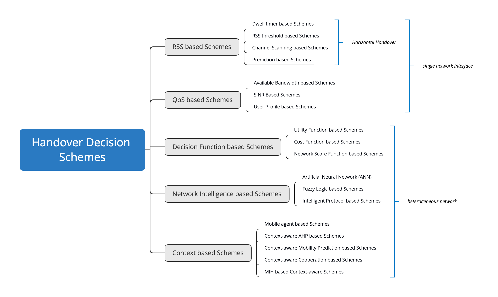

## The Topic: Handover Management of High-Speed Mobile Users in Ultra-Density Networks
----
### Motivation

As an important branch of the Internet of Things, the Internet of Vehicles is popular among users because it can relieve traffic pressure and help people to travel safely and conveniently. In the face of current heterogeneous high-density networks, vehicles will generate a large number of Handover decision during high-speed driving. To ensure the stability of the connection and low latency, it is necessary to find the best solution.The results of this research will be applied to UAV, high-speed trains etc.

----
### An Introduction of UDN
**A. Definitions of UDN**

>Ultra-Dense Networks can be defined as those networks where there are more cells than active users. In other words, , where  is the density of access points, and  is the density of users.  

>Another definition of UDN was solely given in terms of the cell density, irrespective of the users density. Ding et al. provided a quantitative measure of the density at which a network can be considered ultra-dense (≥ 103 cells/km2).

**B. Features of UDN**
1. A small coverage area, many small cells would be in a very close distance to the users.
2. Due to the high density of small cells, many small cells would be inactive.
3. Close proximity of the small cells to each other in UDN environments generates high interference.
4. Innovative frequency reuse techniques are required.
5. The backhaul of a small cell might be the bottleneck of its capacity, where the backhaul capacity would limit the air-interface capacity.
6. High probability of Line-of-Sight (LOS) transmissions.

**C. Modeling Techniques**
1. Game Theory
2. Stochastic Geometry
3. Mean-Field Games

**D. Performance Metrics**
1. **Success Probability and Outage Probability:** The probability that the SINR of a randomly selected user is above a certain threshold. In other words, the link quality is good enough to proceed to a successful connection.

2. **Rate Coverage and Rate Outage:** *Rate Coverage:* The probability that the achievable rate of an arbitrary user is above a certain minimum； *Rate Outage:* the probability that the achievable rate of an arbitrary user falls below a certain threshold.

3. **Average Spectral Efficiency:** The average number of transmitted bits per second per unit bandwidth represents the efficiency of the spectrum.

4. **Area Spectral Efficiency: Densification:** The average achievable data rate per unit bandwidth per unit area.

5. **Network Throughput:** The average number of successfully transmitted bits per sec. per Hz. per unit area.

6. **Energy Efficiency:** The ratio of the network through- put or the ASE to the power consumption per unit area.

7. **Fairness:** The fairness index measures how likely a given resource allocation scheme is fair.

Figure 1. Research Direction of Ultra-Dense networks 

---

### An Introduction of Vertical Handover Decisions
**A. Definitions**
 > *Horizontal Handover:* The mobile node (MN) moves between two cells using the same technology.

 > *Vertical Handover:* A handover between two different access technologies.

 **B. Handover Decision Metrics**
 1. **Received Signal Strength Indicator(RSSI):** RSSI provides information about the power level being received by the antenna.

 2. **Network Load:** bandwidth

 3. **Handover Delay/Latency:** Users to make a new association with the network and this procedure might take delays

 4. **Handover failure probability:** It occurs when a handover is initialized by the network ’A’ but the target network ’B’ does not accommodate the handover request due to deficiency of resources.

 5. **Throughput:** It refers to the data rate provided to the MNs in a network. Mobile

 6. **Bit error rate (BER):** BER is the number of received bits that have been altered due to noise and interference, divided by the total number of transferred bits during a time interval.

 7. **Signal to Noise Ratio (SNR): SNR** The ratio of signal power to the noise power,
 

 
 
Figure 2. Research Direction of Handover Decisions 

 

