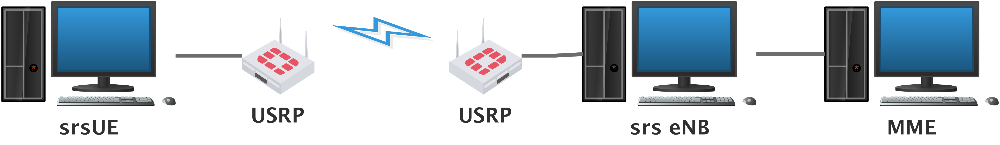
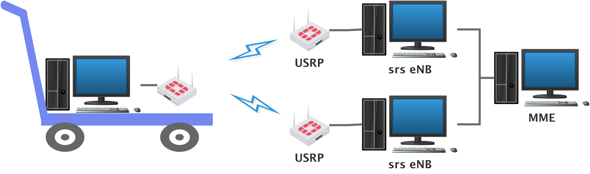

## Demonstration System of Ultra-Dense Network  Using USRP Testbed
---
#### Steps of Project Implementation
>1. Building a simple eNB+UE network(1 to 1) based on the open source project 'OpenAirInterface' or 'srsLTE'.

>2. Building an eNB+eNB+UE network(2 to 1) try cell handover.

>3. Continue to expand the network scale to achieve ultra-dense network demonstration system

---
#### Open Research Questions
1. We know，the global knowledge could provide enhanced information to mobile terminals(MTs) enabling dynamically optimized policies, towards achieving a local optimum in balance with the global optimum, according to an evolutionary process. but how to do?[1]-2019

2. The energy efficient wireless backhauling[2]-2016

3. 

---
#### Definition

>**eNodeB:** **Evolved Node B**(abbreviated as **eNodeB** or **eNB**).eNodeB=RRU+BBU+RNC.

>**Remote Radio Unit(RRU):** Digital front end for base.

>**BaseBand Unit(BBU):** A baseband unit (BBU) is a unit that processes baseband in telecomm systems. A typical wireless telecom station consists of the baseband processing unit and the RF processing unit (remote radio unit - RRU). The baseband unit is placed in the equipment room and connected with RRU via optical fiber. The BBU is responsible for communication through the physical interface. A BBU has the following characteristics: modular design, small size, low power consumption and can be easily deployed.[1]

>**Radio Network Controller (RNC):** A radio network controller (RNC) is a governing element in the UMTS radio access network (UTRAN) and is responsible for controlling the Node Bs that are connected to it. The RNC carries out radio resource management, some mobility management functions and encrypts data before it is sent to and from the mobile. The RNC connects to the circuit switched core network through the media gateway (MGW) and to the SGSN (Serving GPRS Support Node) in the packet switched core network.[2]

>**Evolved Packet Core (EPC):** The key constituents of Evolved Packet Core are:
 * Mobility Management Entity – Helps in authenticating and tracking users in the network as well as managing session states
 * Serving Gateway – Helps in routing data packets across the network
 * Packet Data Node Gateway – Helps in managing quality of service provided and also in deep packet inspection
 * Policy and Charging Rules Function – Helps in policy enforcement and in supporting service data flow detection

 >**Centralized radio access networks(C-RAN):** C-RAN architecture has the following characteristics:
  * Large scale centralized deployment: Allows many RRHs to connect to a centralized BBU pool.
  * Native support to Collaborative Radio technologies: Any BBU can talk with any other BBU within the BBU pool with very high bandwidth (10Gbit/s and above) and low latency (10us level).
  * Real-time virtualization capability based on open platform: A C-RAN BBU pool is built on open hardware, like x86/ARM CPU based servers, and interface cards that handle fiber links to RRHs and inter-connections in the pool.

[1]:https://www.exfo.com/en/resources/glossary/baseband-unit/
[2]:https://www.idt.com/application/network-communications/radio-network-controller-rnc
