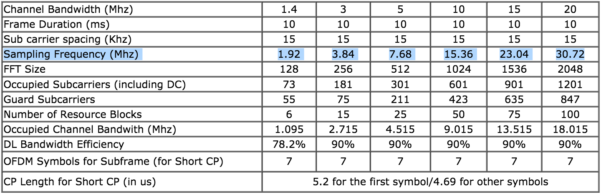

## LTE Implementation Issue on USRP Testbed
---
### Most Famous LTE Open Source Platforms don't Support Ettus N210.
#### 1. OpenAirInterface
[https://gitlab.eurecom.fr/oai/openairinterface5g/wikis/OpenAirSystemRequirements#supported-rf](https://gitlab.eurecom.fr/oai/openairinterface5g/wikis/OpenAirSystemRequirements#supported-rf)
>**Supported RF:**  
>
>   USRP B210 [http://www.ettus.com/product/details/UB210-KIT](http://www.ettus.com/product/details/UB210-KIT)  
>   USRP X310 [http://www.ettus.com/product/details/X310-KIT](http://www.ettus.com/product/details/X310-KIT)  
>   BladeRF [http://nuand.com/](http://nuand.com/)  
>   LimeSDR [http://limesdr.org/](http://limesdr.org/)  
>   EURECOM EXPRESSMIMO2 RF, [http://openairinterface.eurecom.fr](http://openairinterface.eurecom.fr)  

#### 2. srsLTE
[https://github.com/srsLTE/srsLTE#hardware](https://github.com/srsLTE/srsLTE#hardware)
>**Hardware**  
>The library currently supports the Ettus Universal Hardware Driver (UHD) and the bladeRF driver. Thus, any hardware supported by UHD or bladeRF can be used. There is no sampling rate conversion, therefore the hardware should support 30.72 MHz clock in order to work correctly with LTE sampling frequencies and decode signals from live LTE base stations.  
>We have tested the following hardware:  
>* USRP B210
>* USRP B205mini
>* USRP X300
>* limeSDR
>* bladeRF

----

### Why don't Support N210
[LTE Quick Reference](https://www.sharetechnote.com/html/Handbook_LTE_PhyParameter_DL_FDD.html)

The hardware limitation is that master clock of the N210 is fixed at 100 MHz, which is not a multiple of common LTE sample rates.

Physical Layer Parameter

USRP Parameter

---

### Solution

Q6: Does OpenAirInterface work with the Ettus N210?[[1]](https://gitlab.eurecom.fr/oai/openairinterface5g/wikis/FAQ)

A6. The software should run, but the reference on the N210 is not at a frequency that can generate the required 7.68/15.36 MHz sampling. You should be able to get the OAI eNB to work with the OAI UE running at the wrong sampling rate though.

### Reference
[1] https://gitlab.eurecom.fr/oai/openairinterface5g/wikis/FAQ
[2] https://docs.srslte.com/en/latest/srsue/source/1_ue_intro.html
[3] http://www.sharetechnote.com/html/SDR_srsLTE_Api.html
