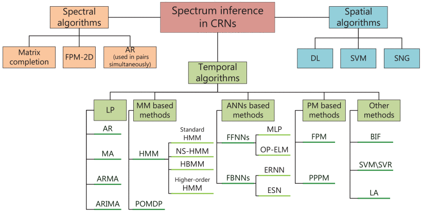

## Spectrum Prediction in Cognitive Radio Networks:An Evolutionary Game Approach  
---
### Motivation
The first step of implementing a CR is to capture the relevant information about the spectral evolution. spectrum sensing determines the spectrum state in a passive manner using various signal detection methods. By contrast, spectrum inference/prediction is a promising technique of inferring the occupied/free state of radio spectrum from already known/measured spectrum occupancy statistics by effectively exploiting the inherent correlations among them.

### Algorithms of Spectrum Prediction Usage
The traditional spectrum prediction algorithms is as follows：

Figure 1. Taxonomy of spectrum prediction algorithms<a href="https://ieeexplore.ieee.org/document/8031332">[1]</a>

### Game theory model in Cognitive radio Networks

Figure 2. Social Game Model in Cognitive Radio Networks<a href="https://ieeexplore.ieee.org/document/7795166">[2]</a>

---

### Prediction based on node rationality behavior（Perfect Bayesian equilibrium）
>Rationality[[3]](http://www.gametheory.net/dictionary/Rationality.html)：One of the most common assumptions made in game theory (along with common knowledge of rationality). In its mildest form, rationality implies that every player is motivated by maximizing his own payoff. In a stricter sense, it implies that every player always maximizes his utility, thus being able to perfectly calculate the probabilistic result of every action.

**Assuming nodes are rational, node behavior is predictable.**  
**This prediction is necessarily better than the results based on statistics.**

---
### Estimate strategy profile based on statistical information
>Trembling hand perfect equilibrium[[4]](https://en.wikipedia.org/wiki/Trembling_hand_perfect_equilibrium)：This is the "trembling hands" of the players; they sometimes play a different strategy, other than the one they intended to play. Then define a strategy set S (in a base game) as being trembling hand perfect if there is a sequence of perturbed games that converge to the base game in which there is a series of Nash equilibria that converge to S.
1. Assume each participant's strategy space is a subset of European space.
2. kakutani fixed point theorem:The process of iterating a function produces a fixed point.
3. result：Convergence to the Markov matrix

### A game in which cooperative games and non-cooperative games coexist（hawk-dove game）
>**HAWK:** very aggressive, always fights for some resource. (Greedy algorithm)  
>1. Simple algorithm  
>2. Real-time   
>3. No conflict detection  

>**DOVE:** never fights for a resource -- it displays inany conflict and if it is attacked it immediately withdraws before itgets injured.(cooperative games)  
>1. Reliable data transfer  
>2. Small interference to the network  
>3. High spectral efficiency  
>4. Power saving  

### Reference
[1] Ding, Guoru, et al. "Spectrum inference in cognitive radio networks: Algorithms and applications." IEEE Communications Surveys & Tutorials 20.1 (2017): 150-182.  
[2] Huang, Zhaolong, et al. "Social-aware resource allocation for content dissemination networks: An evolutionary game approach." IEEE Access 5 (2016): 9568-9579.  
[3] http://www.gametheory.net/dictionary/Rationality.html  
[4] https://en.wikipedia.org/wiki/Trembling_hand_perfect_equilibrium  
2 Spectrum demand forecast based on road information
