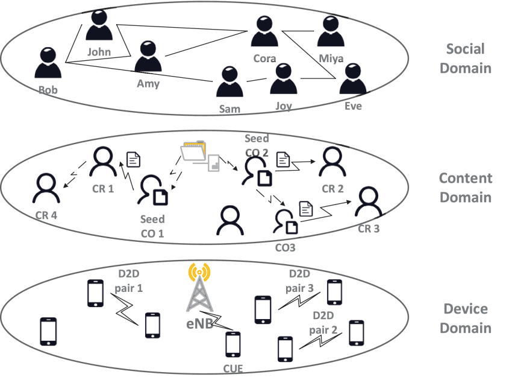

## Spectrum Prediction in Cognitive Radio Networks:An Evolutionary Game Approach  
---
### Motivation
The first step of implementing a CR is to capture the relevant information about the spectral evolution. spectrum sensing determines the spectrum state in a passive manner using various signal detection methods. By contrast, spectrum inference/prediction is a promising technique of inferring the occupied/free state of radio spectrum from already known/measured spectrum occupancy statistics by effectively exploiting the inherent correlations among them.

### algorithms of Spectrum prediction Usage
The traditional spectrum prediction algorithms is as follows：

Figure 1. Taxonomy of spectrum prediction algorithms<a href="https://ieeexplore.ieee.org/document/8031332">[1]</a>

### Game theory model in Cognitive radio Networks

Figure 2. Social Game Model in Cognitive Radio Networks<a href="https://ieeexplore.ieee.org/document/7795166">[2]</a>

### Prediction based on node rational behavior
Rationality：One of the most common assumptions made in game theory (along with common knowledge of rationality). In its mildest form, rationality implies that every player is motivated by maximizing his own payoff. In a stricter sense, it implies that every player always maximizes his utility, thus being able to perfectly calculate the probabilistic result of every action.[[3]](http://www.gametheory.net/dictionary/Rationality.html)

### open Issues
1 据我们所知，很少有研究集中在频谱推断的理论性能分析上。正如香农容量给出了各种调制和编码方案的上限一样，各种频谱推断技术也应该有基本的性能极限。  当前人们使用信息商的方法判断预测的性能极限，也有人用张量，那我就更进一步
我这里给出基于随机矩阵理论的检测方法，优点1，天生处理矩阵。 2 对相关性敏感，

2 Spectrum demand forecast based on road information
### A game in which cooperative games and non-cooperative games coexist（hawk-dove game）

### Reference
[1] Ding, Guoru, et al. "Spectrum inference in cognitive radio networks: Algorithms and applications." IEEE Communications Surveys & Tutorials 20.1 (2017): 150-182.  
[2] Huang, Zhaolong, et al. "Social-aware resource allocation for content dissemination networks: An evolutionary game approach." IEEE Access 5 (2016): 9568-9579.
[3] http://www.gametheory.net/dictionary/Rationality.html
