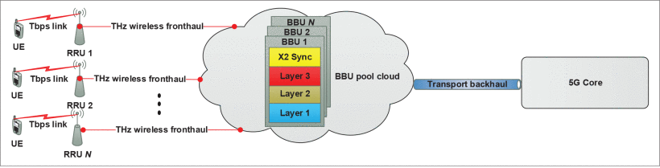
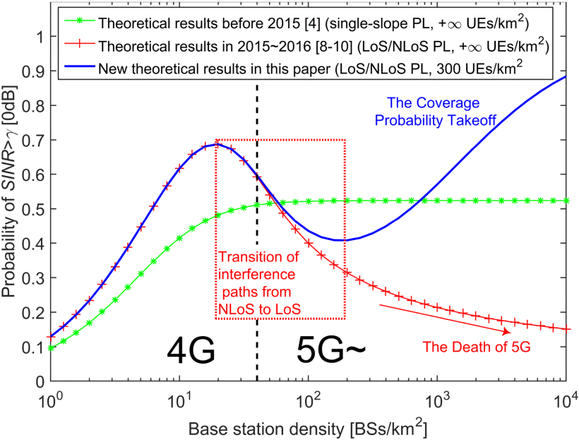

##  Ultra-Dense Network Notes  
---  
### MmWave massive-MIMO-based wireless backhaul for the 5G ultra-dense network, *Cited by 221*, IEEE Wireless Communications, 2015 [[1]](https://ieeexplore.ieee.org/document/7306533)
In this article, The author discusses the feasibility of mmWave massive-MIMO-based wireless backhaul for 5G UDN, and the benefits and challenges are also addressed. by leveraging the low-rank property of the mmWave massive MIMO channel matrix, The Author proposes a *digitally controlled phase shifter network*(***DPSN***)-based hybrid precoding/combining scheme and the associated *compressive sensing*(***CS***)-based channel estimation scheme.

#### The Advantages of MmWave are:
* A large amount of underutilized band in mmWave can be leveraged to provide the potential gigahertz transmission bandwidth.  
* A large number of antennas (massive MIMO) can easily be employed for mmWave communications due to the small wavelength of mmWave, which can improve the signal directivity (reduce the co-channel interference).  

#### MmWAVE is Suitable for Wireless Backhaul in 5G UDN:
1. **High-capacity:** A large amount of underutilized mmWave can provide potential gigahertz transmission bandwidth.
2. **Immunity to interference:** Due to high path loss, mmWave is suitable for UDN, where improved frequency reuse and reduced inter-cell interference are expected. If we consider very heavy rainfall of 25 mm/hr, the rain attenuation is only around 2 dB in E-band if we consider the distance of a backhaul link is 200 m in typical urban UDN[[2]](https://ieeexplore.ieee.org/abstract/document/7000981).  
3. **Small form factor:** The small wavelength of mm Wave implies that massive antennas can easily be equipped at both macro and small-cell BSs, which can easily be deployed with low-cost sites(e.g., light poles, building walls, bus stations).

#### MmWave Channels with Spatial/Angular Sparsity
MmWave massive MIMO channels exhibit the obviously spatial/angular sparsity due to its high path loss for non-line-of-sight (NLOS) signals. If we consider the widely used uniform linear array (ULA), the point-to-point mmWave massive MIMO channel can be modeled as[[3]](https://ieeexplore.ieee.org/abstract/document/6847111)(Cited by 1091):

where NT and NR are the numbers of transmit and receive antennas, respectively, ρ is the average path loss, L is the number of paths, αl is the complex gain of the lth path, and Θ ∈[0,2π] and φ ∈[0,2π] are azimuth angles of departure or arrival (AoD/AoA). In addition,  

and

#### The Advantages of MmWave Massive MIMO for Channel Estimation  
1. Due to the fixed BS locations and close proximity, mmWave massive MIMO channels used for backhaul stay almost unchanged for a long time. This long coherence time of channels indicates that channels do not need to be estimated very frequently compared to that in RAN.  
2. The low-rank property of the mmWave massive MIMO channel matrix indicates that although the dimension of the matrix can be huge, its effective degrees of freedom (DoF) can be small.  

#### Open Issues
 To realize mmWave massive-MIMO-based backhaul, the cost of conventional high-speed ADC with high resolution can be unaffordable, so low-resolution ADC with low hardware cost is appealing. So far, l-bit ADC-based signal detection and precoding/com-bining have been investigated for mmWave massive MIMO. if low-resolution ADC is adopted, constellation mapping, channel estimation, training signals, and so on may need to be reconsidered.

---

#### Terahertz-Enabled Wireless System for Beyond-5G Ultra-Fast Networks: A Brief Survey, IEEE Network, 2019[[4]](https://ieeexplore.ieee.org/abstract/document/8782882)

This article provides a brief survey of the challenges and opportunities of THz band operation in wireless communication, along with some potential applications and future research directions.

**Beyond-5G (B5G) system**: With 5G Phase 1 finalized and 5G Phase 2 recently defined by 3GPP, B5G is expected to further enhance network performance.

#### There are three major ways to obtain several orders of increase in throughput gain:
  1. Extreme densification of the communication infrastructure.  
  2. Large quantities of newly available spectrum.  
  3. Massive antenna systems, allowing a throughput gain in the spatial dimension.

#### THz spectrum is different from mmWave spectrum
1.  In fact, in THz communications, tera-bit-per-second links could be realized with less spectral efficiency (SE) than at mmWave frequencies.
2.  In addition, THz frequencies enable more directionality than mmWave due to reduced antenna aperture.
3. The shorter wavelength of THz when compared to mmWave makes it more directional and less prone to free-space diffraction.
4. distances between the transmitter and receiver in THz will be much shorter than in mmWave. This will result in the reduction of power consumption.

#### The primary technical objectives for THz communication for B5G ultra-fast networks
* Ultra-high data rates per device (from multiple tens of gigabits to terabits per second) with sufficient transmission distance in complex network environments  
* Ultra-high data rates per area and ultra-massive amounts of connected devices  
* Ultra-reliable connectivity to support various critical applications in mobility environments  
*  Very high energy efficiency (EE) to support ultra-high rates for various mobile terminals and networks  

#### Standardization of THz Communication
Standardization of THz wireless communications started in early **2008** when IEEE established an Interest Group on THz communications (IGTHz).Subsequently, after a couple of years of inactivity, the **IEEE 802.15.3d** (100 Gb/s Wireless) Task Group was established in order to facilitate the standardization of THz communications.  The frequency range in focus has been mostly limited to **252–325 GHz**, while different types of communications (backhaul/fronthaul) for 5G.

#### Emerging Applications of THz Band Communication
automotive, indoor networking, aerospace, healthcare, intrinsically safe environments, location-based services, defense, underwater communication, and so on.  
**Vehicular Communications**
* **Vehicle-to-vehicle (V2V)** communications, where neighboring/cooperating vehicles share perceptual data with each other using THz bands for high-rate and low-latency communication.Each vehicle can use the shared data to extend its perception range, which enables it to reveal hidden objects ahead or in its blind spots and thereby avoid collision with other vehicles.   

* **ehicle-to-infrastructure (V2I)** communications in which the infrastructure or *roadside units (RSUs)* gather sensing data about the vehicles and the surrounding traffic. The sensed data can be used to provide realtime maps of the environment. These maps can be used by the transportation control system for congestion avoidance.

* **In-car communications** where THz bands can provide ultra-high-rate and short-range in-car communication for autonomous driving systems, as well as device-to-device (D2D)-like services for the passengers of the vehicles.

**THz Wireless Fronthaul for a C-RAN-Based System**  
The THz fronthaul is compatible with the ultra-dense deployment of small cells because the fronthaul link can be rather short, so as to mitigate the high path loss of THz signals and guarantee connectivity via line-of-sight (LoS) links.

Figure 1. THz band wireless fronthaul for C-RAN.<a href="https://ieeexplore.ieee.org/abstract/document/8782882">[4]</a>

#### Future Research Directions and Open Issues
* **Network and Deployment Modeling for THz Mobile Networks**  
The Poisson point process (PPP) is the most extensively used approach for modeling network deployment and coverage probability as it holds a key advantage in terms of mathematical tractability. However, PPP has been mostly limited to the 2D plane until now, with some extensions to the 2.5D domain, while future emerging deployment scenarios will be in 3D, adding additional challenges to the problem.  

* **Propagation Modeling for the THz Wireless System**  
Since the future ultra-fast B5G THz network will be modeled in ultra-dense setups consisting of numerous hotspots, researchers should aim to extend the stochastic approach toward the 3D channel model to account for B5G deployment scenarios, including 3D beamforming. Modeling the impact of mobility in THz cellular networks is a fundamental challenge for the B5G system.  

* **Redesign of MAC and Upper Layers for Ubiquitous Terabit-Per-Second Access**  
The high-frequency band also leads to high path loss and weak diffusion signals. Highly directional signals are easily blocked and hard for mobility applications. High path loss leads to the very limited transmission distance. Thus, new error control mechanisms should be proposed, and new networking strategies should be developed to improve the coverage and support the seamless connection.  

### Performance Impact of Idle Mode Capability on Dense Small Cell Networks,  IEEE Transactions on Vehicular Technology, 2018 [[5]](https://ieeexplore.ieee.org/document/8046057)

 the authors of [7] found that the coverage probability performance will start to decrease when the BS density is sufficiently large. The intuition behind this result is that as the BS density becomes larger than a threshold, the aggregate interference power increases faster than the signal power due to the transition of a large number of interference paths from NLoS to LoS.

 in this paper, The intuition behind the Coverage Probability Takeoff is that beyond a certain BS density threshold, the aggregate interference power will be less than that of the case with all BSs being active thanks to the BS IMC, plus the signal power will continuously rise due to the BS diversity gain, thus leading to a better SINR performance as the network evolves into a dense and ultra-dense one.

Figure 2. Theoretical performance comparison of the coverage probability when the SINR threshold γ=0 dB <a href="https://ieeexplore.ieee.org/abstract/document/8782882">[4]</a>

#### The Coverage Probability
the **Coverage Probability** is defined as the probability that the signal-to-interference-plus-noise ratio (SINR) of a typical user equipment (UE) is above a SINR threshold γ.

\gamma \right]
" />  
where the SINR is computed by

Here, h is the channel gain, which is modeled as an exponentially distributed random variable (RV) with a mean of one (due to our consideration of Rayleigh fading mentioned above), P and PN are the BS transmission power and the additive white Gaussian noise (AWGN) power at each UE, respectively, and Iagg is the cumulative interference given by

  
where bo is the BS serving the typical UE, and bi, βi and gi are the i -th interfering BS, the path loss from bi to the typical UE and the multi-path fading channel gain associated with bi, respectively.the BSs in idle modes are not taken into account in the analysis of Iagg.

#### Path Loss Model
A very general path loss model as follows, in which the path loss ζ(r) as a function of r is segmented into N pieces written as

d_{N-1}&space;\end{array}\right." title="\zeta (r)=\left\lbrace \begin{array}{ll}\zeta _{1}(r), & \textrm {when }0\leq r\leq d_{1}\\ \zeta _{2}(r), & \textrm {when }d_{1}<r\leq d_{2}\\ \vdots & \vdots \\ \zeta _{N}(r), & \textrm {when }r>d_{N-1} \end{array}\right." />

where each piece ζn(r),n∈{1,2,…,N} is modeled as

In practice, ALn, ANLn, αLn and αNLn are constants obtainable from field tests [6], [7].

#### The 3GPP Special Cases  

 we use the path loss function ζ(r), defined in the 3GPP as [6]

  

together with a linear LoS probability function of PrL(r), defined in the 3GPP as  [7]

&space;d_{1}&space;\end{array}\end{array}\right." title="\textrm {Pr}^{\textrm {L}}(r)=\left\lbrace \begin{array}{ll}\begin{array}{l}1-\frac{r}{d_{1}},\\ 0, \end{array} & \begin{array}{l}0 < r\leq d_{1}\\ r > d_{1} \end{array}\end{array}\right." />

this 3GPP special case is referred to as **3GPP Case 1** in the sequel.

Moreover, as another application of our analytical work and to demonstrate that our conclusions have general significance, we consider another widely used LoS probability function, which is a two-piece exponential function defined in the 3GPP as [6], [10]

&space;d_{1}&space;\end{array}\end{array}\right." title="\textrm {Pr}^{\textrm {L}}(r)=\left\lbrace \begin{array}{ll}\begin{array}{l}1-5\exp \left(-R_{1}/r\right),\\ 5\exp \left(-r/R_{2}\right), \end{array} & \begin{array}{l}0<r\leq d_{1}\\ r> d_{1} \end{array}\end{array}\right." />

For clarity, this combined case with both the path loss function and the LoS probability function coming from [6] is referred to as **3GPP Case 2** hereafter.

----
#### Reference
[1]: Gao, Zhen, et al. "MmWave massive-MIMO-based wireless backhaul for the 5G ultra-dense network." IEEE Wireless Communications 22.5 (2015): 13-21.  
[2]: Wei, Lili, et al. "Key elements to enable millimeter wave communications for 5G wireless systems." IEEE Wireless Communications 21.6 (2014): 136-143.  
[3]: Alkhateeb, Ahmed, et al. "Channel estimation and hybrid precoding for millimeter wave cellular systems." IEEE Journal of Selected Topics in Signal Processing 8.5 (2014): 831-846.  
[4]: Huq, Kazi Mohammed Saidul, et al. "Terahertz-Enabled Wireless System for Beyond-5G Ultra-Fast Networks: A Brief Survey." IEEE Network 33.4 (2019): 89-95.   
[5]: Ding, Ming, et al. "Performance impact of idle mode capability on dense small cell networks." IEEE Transactions on Vehicular Technology 66.11 (2017): 10446-10460.  
[6]: J. Andrews, F. Baccelli, R. Ganti, "A tractable approach to coverage and rate in cellular networks", IEEE Trans. Commun., vol. 59, no. 11, pp. 3122-3134, Nov. 2011.  
[7]: X. Zhang, J. Andrews, "Downlink cellular network analysis with multi-slope path loss models", IEEE Trans. Commun., vol. 63, no. 5, pp. 1881-1894, May 2015.  
