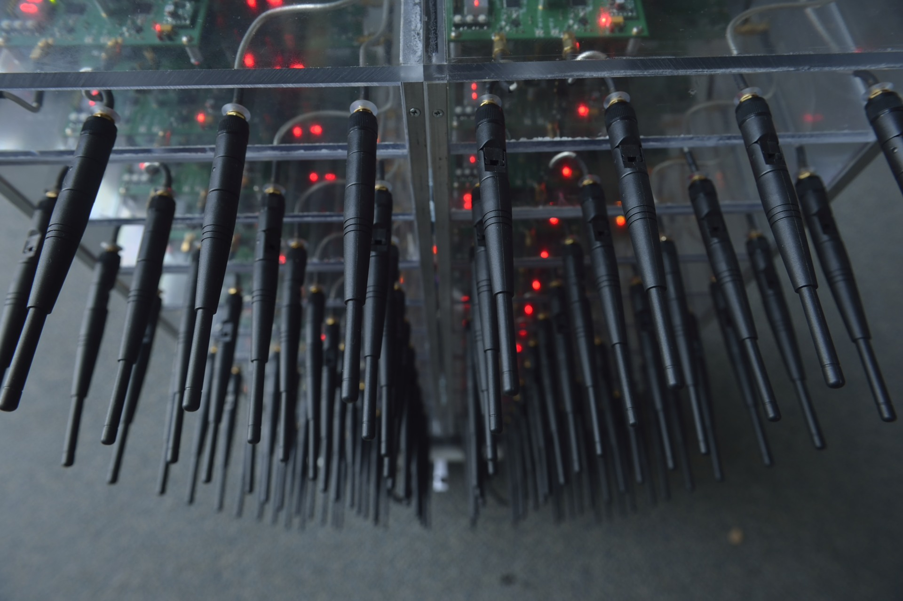
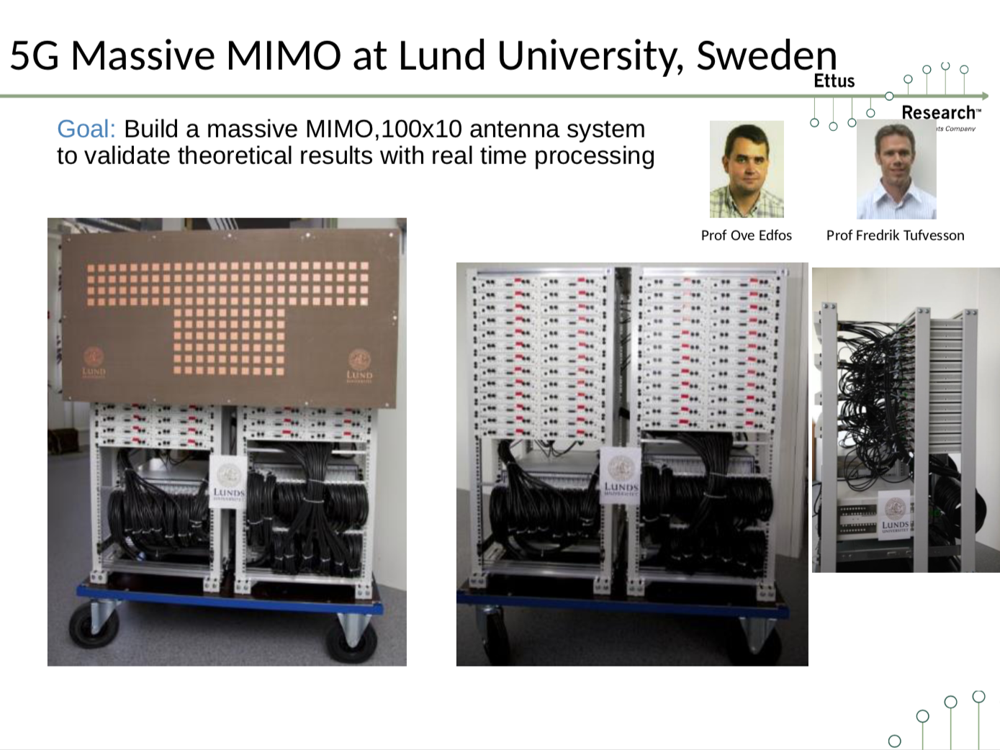
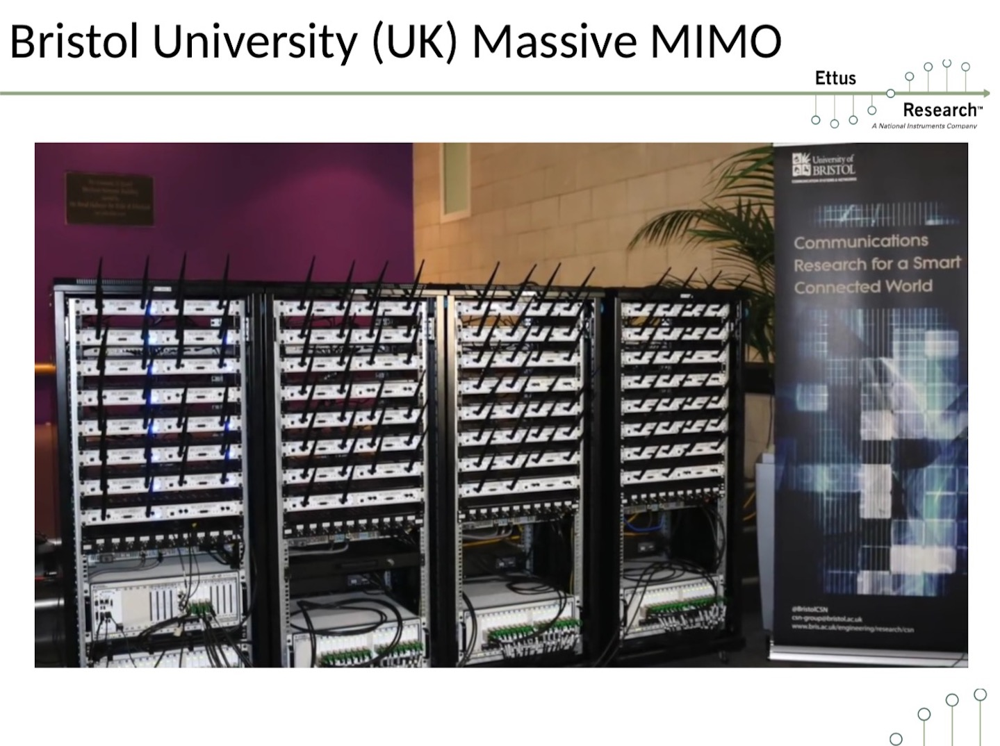

# Weekly Report 2

[toc]

### A university with a large 'SDR testbed' in the world
#### [Rice University](http://argos.rice.edu/#Photos)

 

#### [lund University](https://www.lunduniversity.lu.se/search?tab=publications&query=mimo&page=1&filter=LupfilterByGenreen-Journal%20article_LupfilterByConstituent-yes)

#### [University of bristol](https://www.bristol.ac.uk/engineering/research/smart/5g-demonstrations/massive-mimo/)

